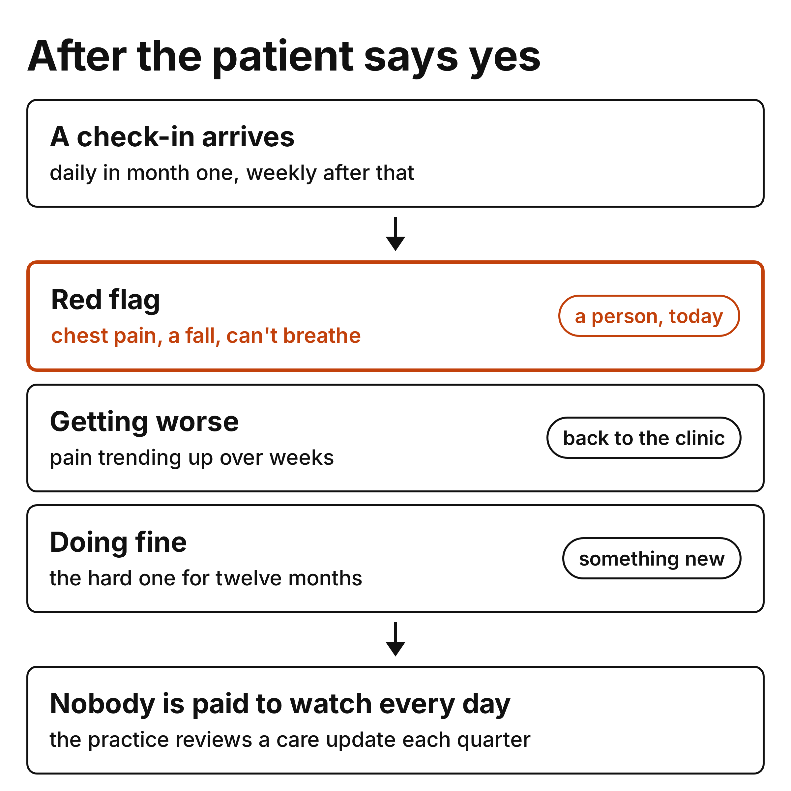

# CMS ACCESS: The Patient Thinks Their Doctor Is Watching

In the [last post](/2026/08/25/cms-access-referrals-are-the-hard-part/) I wrote about getting the patient in the door. This one is about what happens after they say yes.

A few days into the program, one of our first ACCESS patients asked the care coach to pass a message along to their surgeon. That's a completely natural thing to assume. You're texting your pain score every evening, so someone must be reading it. Here's the part I didn't appreciate going in: under this model, nobody on the clinic side is paid to read it. We are. And "we" is mostly software.

<!-- more -->

I want to walk through what the model actually asks of each side, what watching really looks like in our system today, and the three very different patients you end up designing for over twelve months. Some of this we've figured out. Some of it we're still arguing about.

## What the model pays each side to do

The referring clinician's part is small and clearly defined. To bill the co-management fee, they [review an ACCESS Care Update](https://www.cms.gov/priorities/innovation/access-co-management-payment-cmp-billing-guidance){:target="_blank"}, do at least one care coordination activity, and spend a minimum of five minutes on it. That's payable up to three times a year per patient. One of the qualifying activities is "documenting clinical agreement or disagreement with ACCESS recommendations." CMS's own sample care update on the [clinician page](https://www.cms.gov/priorities/innovation/access-primary-care-providers-referring-clinicians){:target="_blank"} ends with "No action is required."

The participant's part is the rest of it. Every claim we submit is an [attestation of active care delivery](https://www.cms.gov/priorities/innovation/files/access-rfa.pdf#page=27){:target="_blank"}, and the RFA spells that out as "patient engagement, monitoring, and timely collection and reporting" of outcome measures. When a patient's needs go beyond what the program can do, our obligation is to "facilitate transition to an appropriate clinician," which the RFA limits to a good-faith referral plus sending along the data we have.

So the monitoring is ours. I think that's the right split, honestly. A PT group with a thousand patients can't triage daily check-ins, and every partner we talk to says some version of the same thing: the referral fee is great, but you can't expect me to look at every escalation. They're right. The question is what "monitoring" means when the monitor is an AI agent and a nightly job.

## What watching actually looks like

Let me describe our system as it runs today, not as the deck describes it.

- A check-in arrives daily for the first four weeks, then three times a week. It asks for a pain number, 0 to 10, for the body region the patient enrolled with.
- A normal number gets a warm reply and goes into the record. The agent is explicitly told not to editorialize on it. No "great score", no "that means you're improving". The number waits.
- Overnight, a sweep reads everything that came in. It flags an 8 or higher, or a score two points above that patient's own two-week median, or a meaningful drop on the function survey. Each flag is deduplicated so the same patient doesn't get flagged every night for the same thing.
- If a message contains a red-flag phrase, chest pain spreading to an arm, a leg that's gone cold, saddle numbness, the model never sees it. A fixed script replies, tells the patient to call 911, and opens an urgent review request.
- If the patient asks for a person, that's a flag too. No score required.

Here's the rule we hold ourselves to on that last part, and it took a while to get right: never tell a patient that someone has been notified unless a person will actually see it. Our emergency templates say "I have created an urgent care-team review request so a clinician can follow up." They don't say "your doctor has been told," because the first sentence is true and the second one isn't.

And here's the thing I'm less comfortable with. Elsewhere in the same prompt, when a patient's trend is declining, the agent is told to reassure them that "their care team keeps an eye on progress." The care team, at that moment, is a nightly sweep and a queue. That's not nothing. It's better than the nothing most discharged PT patients get. But I'm not sure it's what the patient hears.

## Three patients, three paths

Once you accept that watching is a system and not a person, the twelve months split into three patients, and they need different things.

**The red flag.** This is the easy one to design and the hard one to staff. The rules are clear, the script is fixed, and the only real question is who on our side sees the review request and how fast. We spent a good part of July on that exact debate. Chest pain during a home exercise session can't sit in a queue until morning. The consensus, which I agree with, is that this is our responsibility and not the practice's, and it's the one place where the answer has to be a person, today. We're still building that part properly and I'd rather say so.

**The patient getting worse.** Not an emergency. A trend. Pain drifting up over three weeks, function drifting down. What does the program owe them?

I got the clearest answer to this from an advisor who spent years running engagement at a large digital health program. His point was that we were overthinking it. A worsening patient is a referral back to the clinic, and the clinic wants that referral. The reason PT groups are excited about ACCESS in the first place is patient leakage. People finish a course of therapy and vanish, and in [one large low back pain cohort](https://academic.oup.com/ptj/article/100/9/1502/5834618){:target="_blank"} about one in eight self-discharged. A message that says "your pain has been climbing, here's the clinic's number, want to book a visit?" is good for the patient and good for the practice.

Step one is putting the phone number in the message. Step two, which we haven't built, is booking the visit for them. We already have a back door into most of these practices' schedules. Why make the patient dial?

There's a wrinkle here I want to say out loud. The RFA has a [substitute services adjustment](https://www.cms.gov/priorities/innovation/files/access-rfa.pdf#page=29){:target="_blank"}: if a patient gets, say, a new PT evaluation for the same condition while aligned with us, our payment can be reduced. So the right clinical move can cost the participant money. We're going to make the right clinical move anyway, and I think every participant should decide that now rather than the first time it comes up.

**The patient doing fine.** This is the one that will decide whether ACCESS works for anybody, and it's the one I had the least intuition for.

The problem is novelty. A pain score is interesting for about two weeks. After that it's a chore, and a daily chore from a number you don't recognize is how you get the STOP reply. The same advisor put it plainly: you can't run twelve months on "how's your pain today?" You need a reason to come back that wasn't there last month. His suggestions, most of which we're stealing:

- Themes, not a library. This month is flexibility, next month is sleep, then the weather turning and what that does to a knee. Two or three themes to start, not twelve.
- Stage the exercises. We already have a lot of content. Instead of "here are twenty exercises", it's "here's the next one."
- Answer back. When someone types a 4, "recorded" is a depressing reply. "A 4 at week three is on track, here's the one stretch that tends to move a 4 to a 3" is a reason to type the next one.
- Back off from people who don't answer, and keep going with people who do. Daily nudges for a patient who replies every day are fine. Daily nudges for a patient who's been silent for a week are unreturned love.
- Ask at a consistent time that means something. For MSK pain, that's probably before bed, not 5pm.

And then the problem underneath all of it, which he was honest enough to say nobody at his old company solved: the patients who got better leave. They came for the thing, they got the thing, they're done. In a [qualitative study of health app users](https://journals.plos.org/plosone/article?id=10.1371/journal.pone.0156164){:target="_blank"}, the people who had reached their goal simply weren't stimulated to keep going. Our program has an early-finish path for patients who show sustained improvement around month six, and I like that we offer it. But the model measures outcomes at month twelve, and I can't pretend the incentives there are clean. We want them better. We also want them to stay.

## What we're changing this month

Nothing here is finished. This is the list on my desk.

- Weekly check-ins after the first month, with daily kept only for patients who answer daily.
- A reply that responds to the number, not just records it.
- The clinic's phone number in the worsening path now, and a booked visit later.
- Two content themes, staged exercises, and we see which weeks patients actually open.
- A person, not a queue, on the red-flag path, with a target time I'll publish once we hit it.
- Fixing the copy. If the agent says someone is watching, someone should be.

## Final thoughts

The referral post was about a problem the RFA doesn't mention. This one is about a sentence the RFA does contain, "patient engagement, monitoring," and how much of a company you can build inside it.

What I keep coming back to is the patient who asked us to tell their surgeon. We routed it correctly. The system did what it was designed to do. And I still think the patient walked away believing something about who was watching that wasn't quite true. I don't have a clean answer for that yet.. maybe the answer is that we say exactly what happens to their message, every time, and let them decide if that's enough.

If you're running an ACCESS program and have figured out the patient who's doing fine in month seven, I'd love to compare notes.
