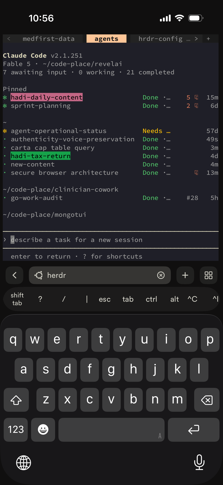
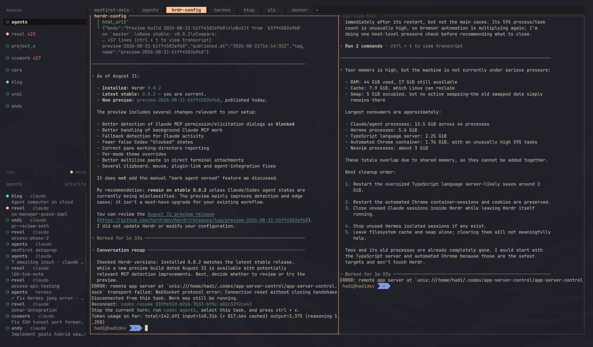
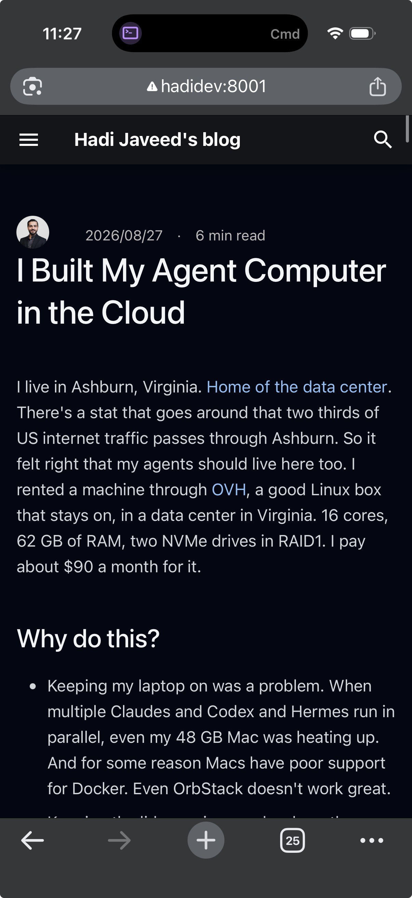
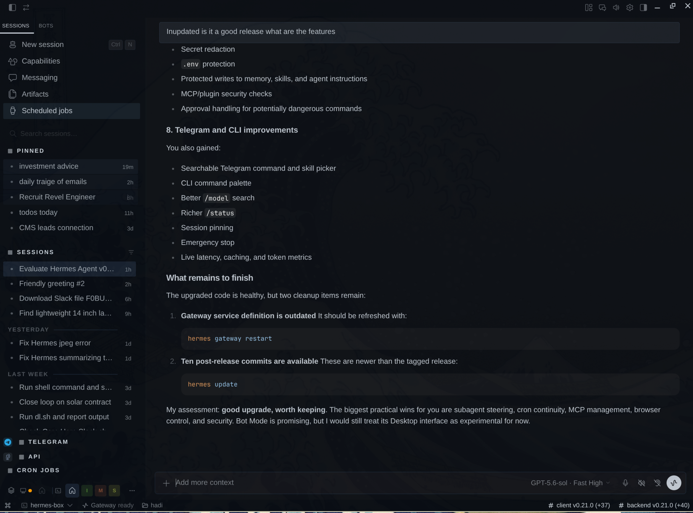
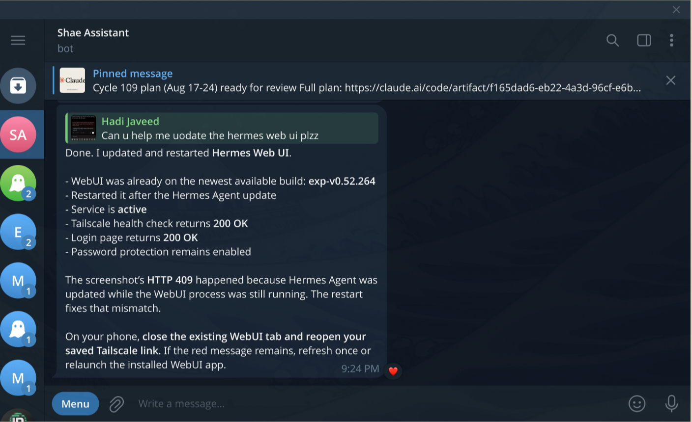
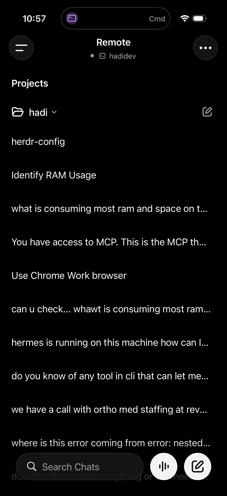
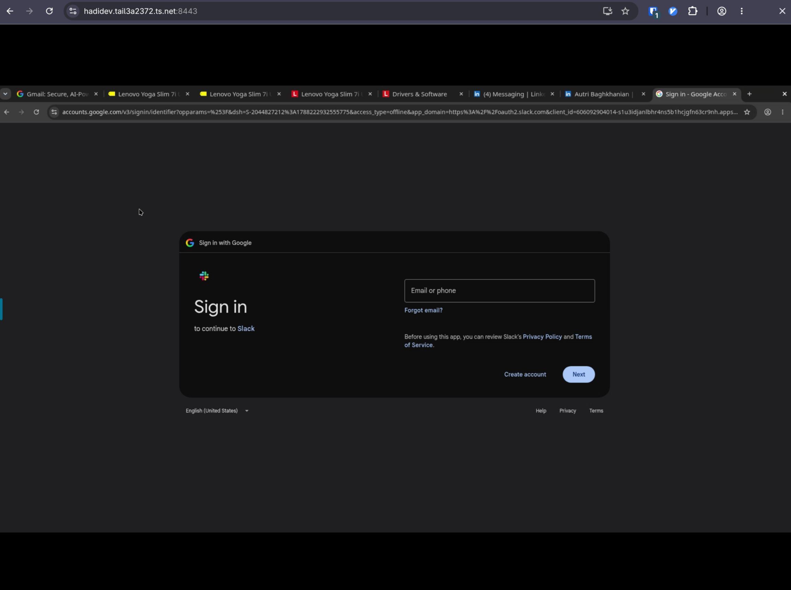

---
authors:
  - hjaveed
hide:
  - toc
date: 2026-08-27
readtime: 6
slug: agent-computer-in-the-cloud
comments: true
---

# I Built My Agent Computer in the Cloud

I live in Ashburn, Virginia. [Home of the data center](https://www.digitalrealty.com/resources/blog/northern-virginia-ashburn-data-centers){:target="_blank"}. There's a stat that goes around that two thirds of US internet traffic passes through Ashburn. So it felt right that my agents should live here too. I rented a machine through [OVH](https://us.ovhcloud.com/){:target="_blank"}, a good Linux box that stays on, in a data center in Virginia. 16 cores, 62 GB of RAM, two NVMe drives in RAID1. I pay about \$90 a month for it.

<!-- more -->

## Why do this?

- Keeping my laptop on was a problem. When multiple Claudes and Codex and Hermes run in parallel, even my 48 GB Mac was heating up. And for some reason Macs have poor support for Docker. Even [OrbStack](https://orbstack.dev/){:target="_blank"} doesn't work great.
- Keeping the lid open in a mode where the laptop stays on adds a lot of tax.
- I/O tax. [Agents browse a lot more than a human does](https://www.imperva.com/blog/bad-bot-report-2026-bots-agentic-age/){:target="_blank"}. They fetch, they scrape, they pull packages. The box has a 1 Gbps line, so they search faster and iterate faster, and my laptop doesn't pay the I/O tax at all.
- A computer that's available on the go. I can log in from anywhere and get things done. Even when the internet is bad where I am, it doesn't matter much. Most of the work is done by the agents. I just give them the command.

This is [Termius](https://termius.com/){:target="_blank"} on my iPhone, attached to [Herdr](https://herdr.dev/){:target="_blank"} on the box:

{ width="380" }

## Why not cloud agents?

- Cowork in Claude, GPT working in the cloud, GrokBot, they're all great. But for development I need a more familiar environment. I need a place to have my `.env` files and everything else.
- Cloud agents are coming, and they're good, but I need a real development environment. [Lazygit](https://github.com/jesseduffield/lazygit){:target="_blank"}, git tools, a terminal, something to review things with.
- I need a place where my context compounds. [Hermes](https://github.com/NousResearch/hermes-agent){:target="_blank"} is amazing at building skills. I need those skills to compound on my machine, not inside somebody's sandbox. And I can swap any model in and out.

This is what that familiar environment looks like. Herdr on the box, every agent in its own pane:

## But wait, is it secure?

Security for sure is challenging. Tailscale, UFW, backups, and not doing something dumb is most of it.

But hey, that's where agents shine. Fable can give you a secure setup. This is what mine looks like today, and most of it was set up and audited by an agent.

- **SSH is key-only.** No password login, no root login, only my user is allowed in.
- **The box is on my [Tailscale](https://tailscale.com/){:target="_blank"} tailnet.** It has a name, `hadidev`, and every device I own can reach it by that name. Redis, Mongo, dashboards, the Hermes gateway, all of it binds to the Tailscale IP or localhost. Nothing on the public IP except SSH.
- **UFW on the public interface.** Default deny. If something needs to be reachable, it goes through Tailscale, not through an open port.
- **[`tailscale serve`](https://tailscale.com/kb/1312/serve){:target="_blank"} for the ports I want in a browser.** This is the part I like the most. I run something on the box, serve it on the tailnet, and open it on the Mac as `hadidev:8000` or any port I want to make available. It works from the phone too, so I test the localhost sites I'm developing right on my mobile. It's basically localhost, but the localhost is 30 miles away.
- **Secrets stay on the box.** `.env` files are `600`. Keys never leave the machine.
- **Backups.** RAID1 mirror for the disks, plus a nightly encrypted [restic](https://restic.net/){:target="_blank"} backup to [Backblaze B2](https://www.backblaze.com/cloud-storage){:target="_blank"}, with a weekly integrity check. If OVH loses the box, I lose a day.
- **Unattended security updates.** On.
- **A recurring security audit, run by agents.** I have a `/security-audit` skill. It's read-only, never uses sudo, never prints a secret. It fans out to a few Claude workers plus a Codex adversarial pass and writes a dated report. The first run told me things I believed that weren't true: SSH was still answering on the public IP, Docker-published ports were bypassing UFW, and being in the `docker` group is the same as being root. I fixed what it found. That's the loop. The agent audits the machine the agent lives on.

This is how I run my localhost apps and develop on the go. This very post, served by the blog's dev server on the box, open on my iPhone at `hadidev:8001` over Tailscale:

{ width="380" }

## What I use to talk to it

**[Herdr](https://herdr.dev/){:target="_blank"} in the terminal.** A terminal multiplexer built for coding agents. Every agent gets a pane, I can look at any of them, and I can hand work between them. For Herdr I use the local gateway connect, so from the Mac I attach straight to the Herdr server running on the box.

**[Termius](https://termius.com/){:target="_blank"} from the phone and tablet.** SSH over [Tailscale](https://tailscale.com/){:target="_blank"}. I've reviewed a PR and kicked off an agent from a parking lot. I sometimes code from the iPad with Termius too. It just helps.

**Hermes desktop and mobile apps, through the gateway.** The gateway runs on the box, and the apps just connect to it. It's beautiful and it works. Everything compounds on my server, the skills, the memories, all of it. Here's the desktop app connected to Hermes on the box:

**Hermes on Telegram.** The same Hermes is connected to Telegram through the gateway. I call her Shae Assistant. I text her like I'd text a person, and she does the work on the box:

**Codex remote.** The Codex app points at the box, so Codex runs there with everything else. And the ChatGPT voice mode is great. I talk, it works:

{ width="380" }

## The browser lives there too

I host a Chrome browser on the server, in a Docker container. The agents drive it. They can browse, click, fill forms, and keep iterating on their own without any particular issues. And just like Grok bot, they can log into LinkedIn or any site that has no API and get things done right in the browser, no MCP required.

It's available to me too. When I want to see what they're doing, I open that same Chrome from my Mac over Tailscale and watch, or review what it did afterwards. My laptop never runs a browser for an agent. This is that browser, opened from my Mac:

## Getting files in and out

Now you'd think, how do I upload something to the server, or download things, or review things? A few ways.

- Most of the time I don't need to move anything. There are so many good TUIs now. Neovim with LazyVim, lazygit, whatever, just to take a look at something right on the box.
- I have two small shell functions. One takes a file from my Mac to the dev box, and `tomac` takes a file from the dev box to my Mac. Under the hood it's just [Tailscale file transfer](https://tailscale.com/kb/1106/taildrop){:target="_blank"}, so it works from anywhere.
- If I'm attached through Herdr in remote mode, I can paste things right into the CLI, or drop a file on it, and it lands on the box. The agent takes it from there.

## Everything runs forever

This is the thing I didn't expect to love. There's an agent browser installed on the box. I set it up once, and it's been running ever since. Same for the blog dev server, the databases, the gateway. The box has been up for weeks. I close the laptop and nothing stops.

And this works really well. My laptop doesn't heat up any more, and it's great.

I could not be happier.

I do think this is where the puck is going. The big cloud providers, the labs, the model providers, they're all building this in some shape or form. An always-on computer for your agents. But I need something that is familiar to me, that I control, where my skills and my context compound. So I built mine.
