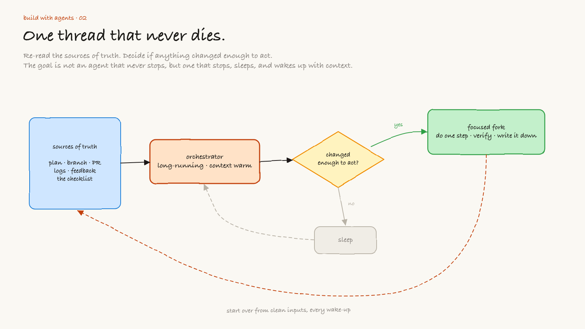
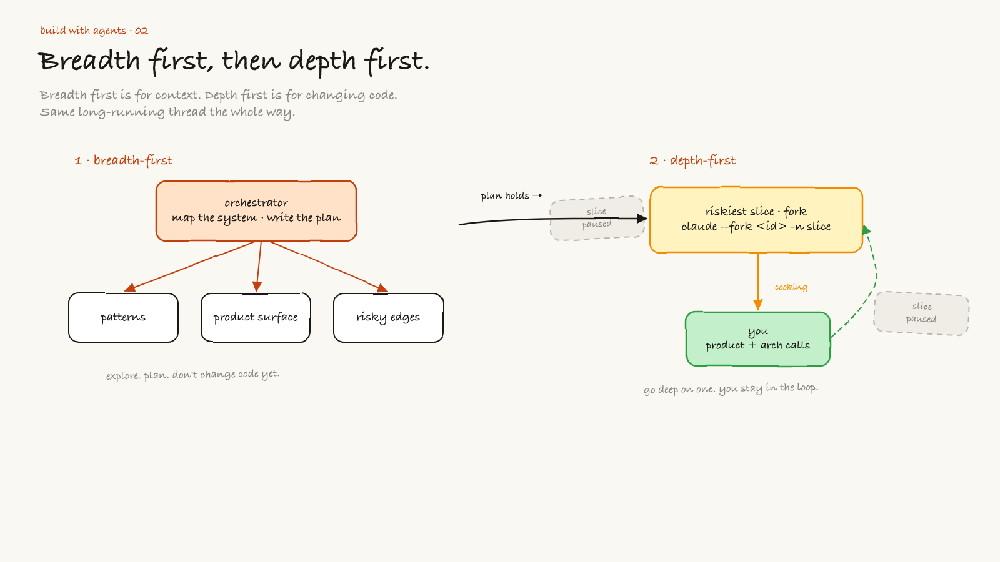
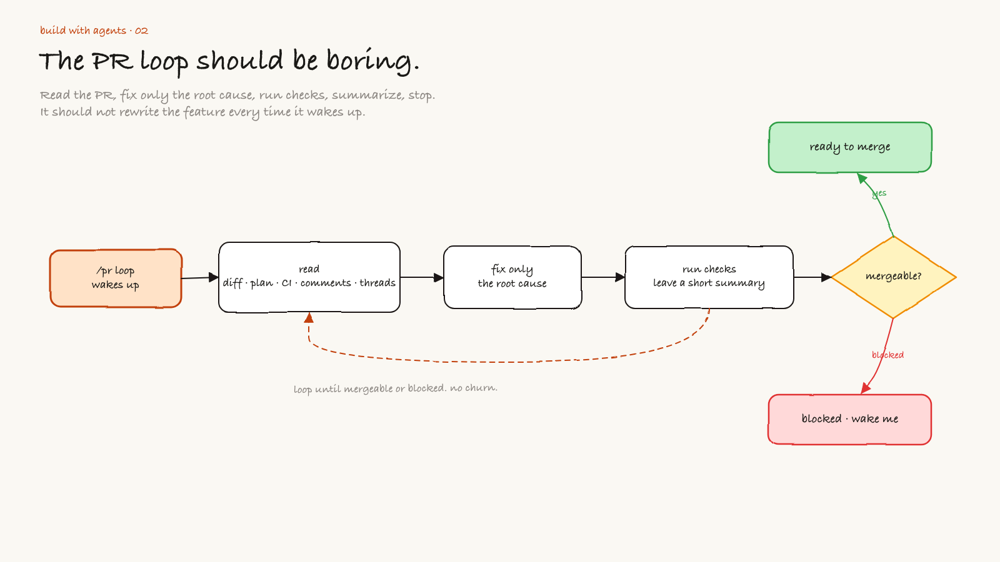
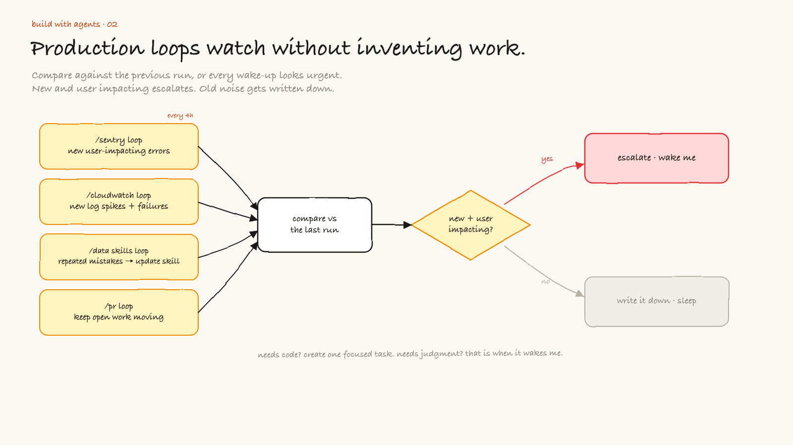

---
authors:
  - hjaveed
hide:
  - toc
date: 2026-06-29
readtime: 8
slug: agent-workflows-and-loops
comments: true
---

# Agent Workflows & Loops

Episode 1 was about using agents to ship faster. Episode 2 is about the part agents still have not solved: production follow-through.

Writing code by hand is mostly automated now. Shipping to production is not, and shipping means more than getting a PR merged. It is testing the feature live, telling your team and your customers how it works, watching logs and analytics for a few days, and iterating on what you learn. Loops are what finally help with that.

A workflow is not just a clever prompt. It is the shape around the agent. What does it read? What does it ignore? When does it fork? When does it stop? When does it wake you up?

That is the difference between a useful long running agent and an expensive tab that slowly drifts away from reality.

<!-- more -->

People have been talking about loops a lot recently. I think that is the right conversation. The model matters, but the loop matters more than people want to admit.

A good loop lets an agent start from the source of truth again and again. It reads the plan, checks the repo, checks the PR, checks production signals, compares what changed, then decides whether anything needs attention.

The goal is not to make an agent that never stops. The goal is to make an agent that knows how to stop, sleep, wake up, and re-enter the work with context.



[Open the editable Excalidraw source](../assets/diagrams/agent-workflows-loops/01-long-running-loop.excalidraw){:target="\_blank"}

## The long running orchestrator

The simplest useful loop looks like this:

1. read the plan
2. read the current code
3. read the latest external signal
4. decide if the signal is new or important
5. act only if there is a focused next step
6. verify the result
7. write down what changed
8. stop

That last step matters. A loop that does not know how to stop becomes a bug factory.

I like to think of the orchestrator as a staff engineer that keeps the context warm. It is not always coding. Most of the time it is watching, comparing, and deciding whether something deserves a focused fork.

Over time this thread becomes your PRD. It carries the research, the tool calls, and the decisions, so you never have to re-explain how you got here. You can start a fresh session, but then you are handing over all of that intent by hand.

The orchestrator should be able to start over from clean inputs:

- the PRD or plan
- the current branch
- the open PR
- logs and errors
- user feedback
- previous decisions
- the checklist for what good looks like

Then it asks one question: did anything change enough that we should act?

## Breadth first, then depth first

When I start a new feature, I still like breadth first. I want the agent to explore the codebase, read neighboring patterns, understand the product surface, and find the risky edges.

Breadth first is for context.

Depth first is for changing code.

If you mix those up, the agent gets lost. It starts solving a local problem before it understands the shape of the system.



[Open the editable Excalidraw source](../assets/diagrams/agent-workflows-loops/02-breadth-then-depth.excalidraw){:target="\_blank"}

My preferred pattern is:

1. use the orchestrator to map the system
2. ask it to write a real plan
3. pick the riskiest slice
4. fork a focused agent into that slice
5. stay in the thread for product and architecture calls
6. bring the result back to the orchestrator

The fork is not the boss. The orchestrator is the boss.

The fork is a focused engineer. It should be deep in one slice: the API boundary, the UI state machine, the data layer, the test harness, or whatever needs real attention.

The orchestrator stays responsible for whether the whole system still makes sense.

## The PR workflow loop

The first loop I want for almost every serious feature is the PR loop.

I do not want to babysit a PR. Waiting on CI and on review comments, from a human or from a coding agent like Codex, Claude, or Greptile, can burn fifteen or twenty minutes a pass, and shepherding one PR across a day can eat hours. I want an agent to keep checking the same boring things until the PR is either mergeable or blocked by a human decision.

A useful `/pr workflow loop` reads:

- the branch diff
- the original plan
- failing checks
- reviewer comments
- unresolved threads
- test output
- files touched since the last pass

Then it does the smallest safe next step.



[Open the editable Excalidraw source](../assets/diagrams/agent-workflows-loops/03-pr-workflow-loop.excalidraw){:target="\_blank"}

The PR loop should not rewrite the feature every time it wakes up. That is how you get churn.

It should be boring:

```text
Read the PR.
Read the plan.
Read CI and review comments.
Fix only the root cause of the current failure.
Run the relevant checks.
Leave a short summary.
Ping me in Slack when it needs my eyes.
Stop if blocked.
```

The best PR loop feels like a careful senior engineer doing follow-through. It does not need applause. It just keeps the branch from getting stale.

## Production loops

After the feature ships, the loop changes.

Now I care less about implementation momentum and more about signal quality. I want the agent to watch production without inventing work.

These are the loops I care about:

- `/sentry loop` every 4 hours: check for new user impacting errors
- `/cloudwatch loop`: check for new log spikes or unexpected failures
- `/data skills improvement loop`: check if the agent made repeated data mistakes and update the skill or checklist
- `/pr workflow loop`: keep open work moving without me babysitting it

That is enough.

The dangerous version is when every loop creates another loop. I do not want recursive busywork. I want a small number of boring loops with clear stop conditions.



[Open the editable Excalidraw source](../assets/diagrams/agent-workflows-loops/04-production-watch-loops.excalidraw){:target="\_blank"}

For production loops, the rule is simple:

```text
If it is new and user impacting, escalate.
If it is old noise, write it down and sleep.
If it needs code, create a focused task.
If it needs judgment, wake me up.
```

The loop should compare against the previous run. Otherwise every wake-up looks urgent.

None of this is hands off. You are still babysitting these loops, only now at a higher level, fixing what matters instead of refreshing dashboards all day.

## The data skills improvement loop

This one is underrated.

Agents make mistakes for two reasons. Sometimes the model fails. Sometimes the loop failed to teach the agent what good looks like.

If I ask an agent to do data work and it repeatedly makes the same mistake, I do not want to just fix the query. I want to improve the skill, checklist, or harness so the next agent is less likely to repeat it.

That loop looks like this:

1. inspect the mistake
2. decide whether it is a one-off or a repeated pattern
3. update the skill, prompt, test, or validation script
4. run the workflow again
5. record what changed

This is how the system gets better over time. Not because the model magically learned from one chat, but because the surrounding workflow got stricter.

## What I want from loops

I want loops that are boring, auditable, and small.

A loop should have:

- a source of truth
- a wake-up schedule
- a narrow job
- a comparison against the previous run
- a stop condition
- an escalation rule
- a place to write the result

If one of those is missing, the loop will probably drift.

The biggest mistake is giving the loop too much agency too early. Do not start with "go fix production." Start with "tell me what changed since last time and whether it matters."

Then let the orchestrator decide if a focused fork should exist.

## The actual pattern

The pattern I keep coming back to is simple:

```text
orchestrator maps the system
focused fork changes one slice
orchestrator vets the integration
loops watch the world after shipping
human makes the product calls
```

That is it.

The loop is not there to replace taste. It is there to keep attention on the right things.

I still want to make the product and architecture decisions. I still want to talk to users. I still want to read the weird errors. But I do not want to be the cron job for my own codebase.

That is what agent workflows are really becoming for me: not a giant swarm, not a fully autonomous company, just a set of loops that keep the work alive without losing the thread.

Have fun building.
