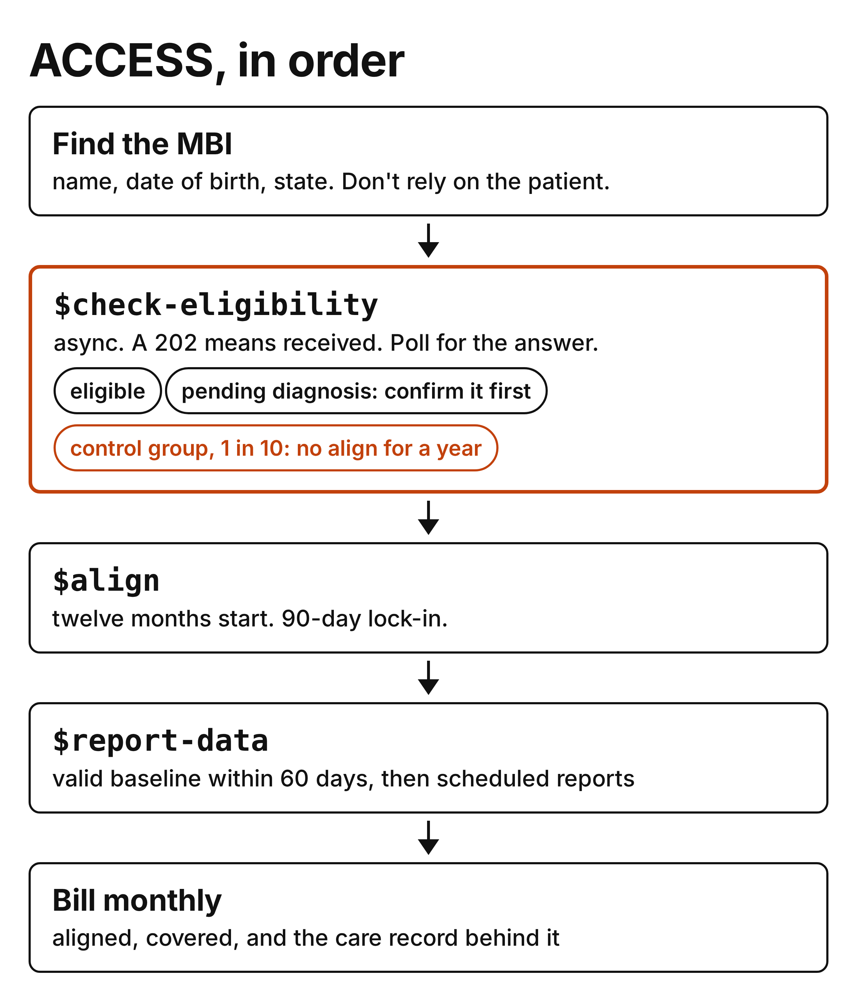
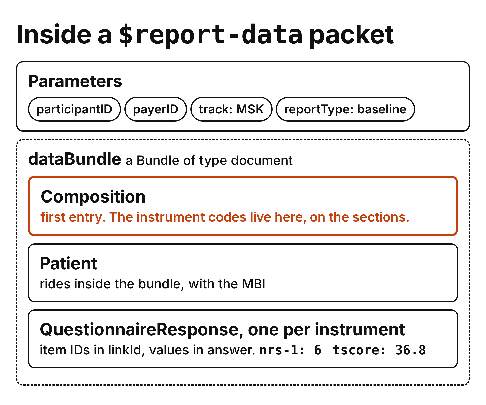
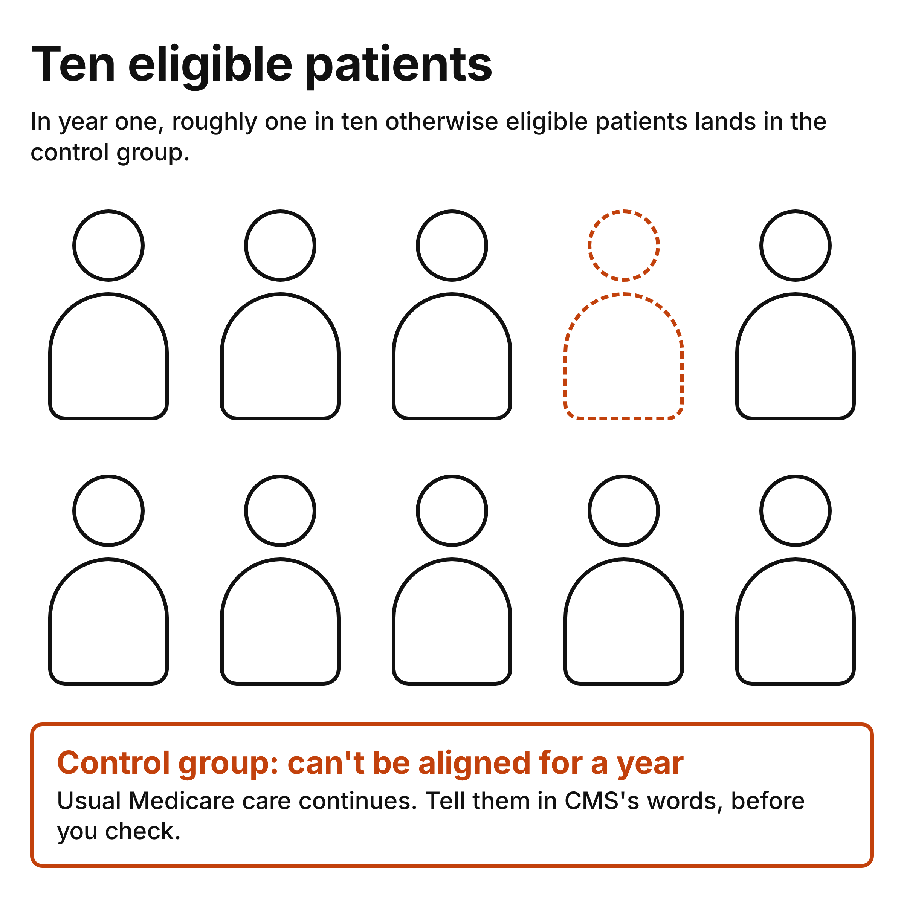
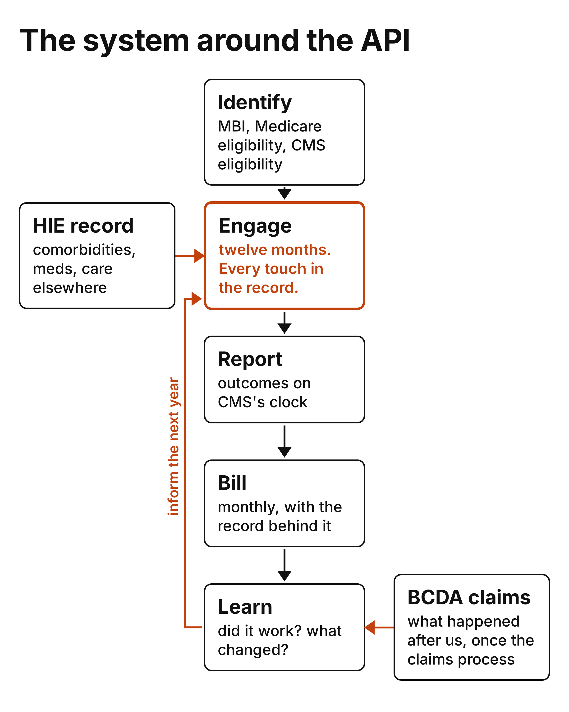

---
authors:
  - hjaveed
hide:
  - toc
date: 2026-09-07
readtime: 11
slug: cms-access-engineers-field-guide
comments: true
draft: true
---

# CMS ACCESS: An Engineer's Field Guide

The reimbursement for ACCESS is small and I'm not going to relitigate it here. What I'll say is that this is the first CMS model I've worked on where a technology-enabled care organization is the aligned participant, gets an eligibility answer from the payer directly, reports the instrument answers and scored values rather than a summary measure, and can ask for the claims afterward. Whether that combination pays for itself depends on acquisition and retention, which was the [previous post](/2026/08/25/cms-access-referrals-are-the-hard-part/), and on how much of the intake, record, and reporting work carries over to the next program, which I don't know yet. My bet is most of it. This post is the technical half of that bet.

Back in March I [built a mock ACCESS FHIR server](https://github.com/hadijaveed/access-fhir-apis){:target="_blank"} against a draft of the spec, mostly to find out what a year of this model would look like end to end. Since then we've sent real packets to CMS's test environment and aligned real patients in the MSK track at [RevelAI](https://www.revelaihealth.com/){:target="_blank"}. So this is what the API actually asks of you, what the packets look like, what CMS's test environment taught us, and the system you end up building around it.

If you're not the one writing the client, here's the short version:

- The API is four operations and one poll. Getting a client to talk to CMS is the easy part, and it's mostly done once it can submit and read a result code.
- The hard part is a year of engagement per patient, with a record good enough to bill from and outcomes reported on CMS's clock.
- The thing worth more than the payment is the loop: eligibility from the payer itself, outcomes on a schedule, and claims data you can ask for. I'll come back to that.

<!-- more -->

Everything below uses IG v0.9.12, published June 10, 2026, which CMS still marks as a draft. Pin the version you build against. The one I built against in March didn't have the reporting operation at all.

## ACCESS, in order



The API has four submission operations, `$check-eligibility`, `$align`, `$unalign`, and `$report-data`, plus `$submission-status`, which is how you get the answer to any of them. The MBI lookup before and the monthly claim after aren't part of the API, but the workflow doesn't work without them.

**0. Get access.** You authenticate with OAuth 2.0 client credentials. The four submission operations POST to `Patient/$operation` with your participant ID as `entityId` in the query string, and you poll the returned status URL with GET. Tokens expire, and the operations are asynchronous, so get a fresh token proactively inside your polling loop rather than discovering it expired mid-poll. Ask CMS for test credentials before you write a line of the client. More on that below.

**1. Find the MBI.** Every patient in ACCESS is referenced by their Medicare Beneficiary Identifier, eleven characters, uppercase, no dashes when you send it. Don't rely on the patient to give it to you. Ours typed the sample number off a Google image, typed it with the dashes, or skipped it. Two kinds of API do this work. An insurance eligibility API like [Sohar](https://www.soharhealth.com/){:target="_blank"} runs real-time eligibility checks, and its coverage discovery finds what insurance a patient has from first name, last name, date of birth and state, without the patient handing you a card. An MBI lookup like [Stedi's](https://www.stedi.com/docs/healthcare/mbi-lookup){:target="_blank"} takes the same four inputs and returns the identifier itself, with Medicare eligibility in the response, once you've done the provider transaction enrollment. Between them you get the answer you need before anything else: is this Original Medicare? ACCESS is Original Medicare only. Medicare Advantage patients get a polite no, and coverage gets re-checked before a claim goes out, because it does change.

**2. `$check-eligibility`.** Asynchronous. You POST, you get a 202 with a `Content-Location` header and no body, and you poll that URL. The manual suggests a first poll after five to ten seconds, then every ten to thirty seconds, with a five-minute timeout. Store the status URL with the patient record so a restart can resume the poll. A 200 means CMS finished, not that the patient is eligible. The answer is one of [ten result codes](https://dsacms.github.io/cmmi-access-model/en/CodeSystem-ACCESSEligibilityResultCS.html){:target="_blank"}, and your code has to read it before it changes anything about the patient. Errors come back as `OperationOutcome`. On a 400, fix the request before you resubmit. On a 401, get a new token and retry once. On a 503, honor `Retry-After` when it's there and back off. Keep the outcome details either way, because they're the only explanation you'll get.

**3. `$align`.** Same envelope, three differences: at least one `Condition` is now required, you send a boolean for whether a provider referred the patient, and if the patient is switching from another participant you send a switch-consent attestation, after you've actually documented that consent. The twelve-month care period starts on the date CMS assigns when alignment succeeds. In MSK there's a 90-day lock-in before a patient can switch to another participant. `$unalign` is the reverse, with a reason code. Inside the lock-in a patient-initiated request comes back refused, and some reasons go to manual review rather than a same-day answer.

**4. `$report-data`.** Baseline, then quarterly, then end of period. The deadlines are the first thing your engagement system has to be built around:

| Report | Window |
| --- | --- |
| Baseline | Within 60 days of alignment, or the patient is unaligned |
| Quarterly | 70 to 110 days after the previous submission |
| End of period | By day 425. MSK and BH can report early success up to 180 days before day 365 |

MSK reports PROMIS physical function and pain interference, or an approved site-specific measure, plus a pain intensity score and a global improvement rating at the end. Behavioral health reports PHQ-9 and GAD-7 with the same global rating. The cardiometabolic tracks report clinical measures like HbA1c and blood pressure rather than questionnaires.

**5. Bill monthly.** Every claim is an [attestation](https://www.cms.gov/priorities/innovation/files/access-rfa.pdf#page=27){:target="_blank"} of active care that month, which the RFA spells out as engagement, monitoring, and timely reporting. So the billing review needs current alignment, current coverage, the care delivered that month, and the reporting status, per patient. A logged text message on its own isn't a claim.

## What the packets look like

The four submission operations all take a FHIR `Parameters` resource. The eligibility check carries the participant, the payer, the patient, and the track, with conditions when you have them. Diagnoses ride along as `Condition` resources with ICD-10 codes. If the payer is Medicare, the patient resource has to carry the MBI. This is a structural excerpt, with profiles and metadata trimmed. Use the [IG's full example](https://dsacms.github.io/cmmi-access-model/en/Parameters-CheckEligibilityRequestExample.html){:target="_blank"} for a real submission. Every identifier here is synthetic.

```json
{ "resourceType": "Parameters",
  "parameter": [
    { "name": "participantID", "valueIdentifier": { "value": "ACCES12345" } },
    { "name": "payerID", "valueIdentifier": {
        "system": "urn:oid:2.16.840.1.113883.3.221.5", "value": "12345" } },
    { "name": "patient", "resource": {
        "resourceType": "Patient",
        "identifier": [{ "system": "http://terminology.hl7.org/NamingSystem/cmsMBI",
                         "value": "1EG4TE5MK73" }],
        "name": [{ "family": "Doe", "given": ["John"] }], "birthDate": "1950-01-01" } },
    { "name": "track", "valueCodeableConcept": { "coding": [{ "code": "MSK" }] } },
    { "name": "condition", "resource": {
        "resourceType": "Condition",
        "code": { "coding": [{ "system": "http://hl7.org/fhir/sid/icd-10-cm", "code": "M54.50" }] } } }
  ] }
```

The reply is a 202 with a `Content-Location` like `.../Patient/$submission-status/sub-123456`. While CMS is working, polling it returns another 202 with nothing in it. When it's done you get a 200 and a `Parameters` with one `result`. This is the one that will shape your product:

```json
{ "resourceType": "Parameters",
  "parameter": [
    { "name": "result", "valueCodeableConcept": {
        "coding": [{
          "system": "https://dsacms.github.io/cmmi-access-model/CodeSystem/ACCESSEligibilityResultCS",
          "code": "not-eligible-control-group" }],
        "text": "The patient is technically eligible for the ACCESS Model, but based on the randomized control group algorithm, the patient has been placed in the control group for 12 months and therefore cannot be aligned for 12 months." } }
  ] }
```

`$report-data` is the one worth studying, and it's the one I got wrong in March. The draft spec said reporting was "coming in a future release," so my sandbox guessed MeasureReport plus Observation, borrowed from the Da Vinci quality-measure work. The spec that shipped in June uses a document bundle instead. For MSK it holds the questionnaire responses themselves, answers and scored values both. My reading is that this gives CMS room to revisit how it evaluates outcomes later, and it's not what I would have guessed.



The outer resource is still `Parameters`. Its `reportType` is `baseline`, `quarterly`, or `end-of-period`, which is how the submission is categorized. The clinical dates still live on the resources. The `dataBundle` parameter holds a `Bundle` of type `document`. The first entry has to be a `Composition`, and its nested sections are where the instrument codes live, mostly LOINC, with ACCESS's own codes for QuickDASH and the global improvement rating. Each section points at a `QuestionnaireResponse`. The pain score is one item, `nrs-1`, with an integer. The PROMIS physical function example carries `raw_score` and `tscore` as two more items. And the `Patient` goes inside the bundle. There's no separate patient parameter on this operation, unlike eligibility and alignment. Keep that difference in the client. The excerpt below is synthetic and shows the nesting only. It leaves out required parameters, the pain-interference response you'd send alongside physical function, the instrument answers, and the metadata and narrative the validator wants. It isn't a complete submission; the [complete example](https://dsacms.github.io/cmmi-access-model/en/Bundle-MSKReportDataBundleExample.html){:target="_blank"} is in the IG.

```json
{ "resourceType": "Parameters",
  "parameter": [
    { "name": "reportType", "valueCodeableConcept": { "coding": [{ "code": "baseline" }] } },
    { "name": "dataBundle", "resource": {
        "resourceType": "Bundle", "type": "document",
        "entry": [
          { "resource": { "resourceType": "Composition", "status": "final",
              "title": "ACCESS MSK Track Data Report",
              "section": [{ "code": { "coding": [{ "code": "MSK" }] },
                "section": [
                  { "title": "PROMIS Pain Intensity NRS",
                    "code": { "coding": [{ "system": "http://loinc.org", "code": "72514-3" }] },
                    "entry": [{ "reference": "QuestionnaireResponse/nrs" }] },
                  { "title": "PROMIS Physical Function Short Form 6b",
                    "code": { "coding": [{ "system": "http://loinc.org", "code": "76804-4" }] },
                    "entry": [{ "reference": "QuestionnaireResponse/pf" }] } ] }] } },
          { "resource": { "resourceType": "Patient", "id": "PatientExample" } },
          { "resource": { "resourceType": "QuestionnaireResponse", "id": "nrs", "status": "completed",
              "authored": "2026-01-15T10:30:00Z",
              "item": [{ "linkId": "nrs-1", "answer": [{ "valueInteger": 6 }] }] } },
          { "resource": { "resourceType": "QuestionnaireResponse", "id": "pf", "status": "completed",
              "item": [{ "linkId": "raw_score", "answer": [{ "valueDecimal": 17 }] },
                       { "linkId": "tscore",    "answer": [{ "valueDecimal": 36.8 }] }] } } ] } }
  ] }
```

What this means for your data model: store every patient-reported outcome as a questionnaire response with the instrument's own item IDs, the raw answers, the scored values, and when it was collected. Keep the instrument-to-code mapping at the instrument level. If your scores live in a survey tool as free text, you'll be rebuilding them the week you try to submit.

## What CMS's test environment taught us

CMS runs an implementation environment, IMPL, with synthetic beneficiaries. Participants got test data and testing windows through the spring, and a Connectathon in July. Most of what I actually know about this API came from sending packets there in July, against v0.9.12, and reading what came back. In no particular order:

- A `Parameters` without `meta.profile` is a 400. The profile URL isn't decoration, the validator keys on it.
- Our MSK alignment `Condition`s needed the US Core problem-list category and the MSK condition profile, or they were a 400 too.
- Every resource in a report bundle needs narrative text, including the Composition's track section.
- `$align` doesn't require a prior `$check-eligibility`. You can go straight to alignment if you already know the patient qualifies.
- An eligibility check came back in about fifteen seconds in testing. Write the client as if it could take five minutes anyway.
- The 200 is not the answer. A baseline report for a patient we hadn't aligned yet came back 200, with `patient-not-aligned` inside it. Read the result code before you change state.

None of that is a CMS defect. It's what a strict validator looks like from the outside, and I'd much rather meet it with synthetic patients. How you get into IMPL is at the end of this post.

## One in ten



This is the part of the model that surprised the team most. In year one, CMS randomizes [roughly one in ten](https://www.cms.gov/priorities/innovation/files/access-rfa.pdf#page=39){:target="_blank"} otherwise eligible patients into a control group, on CMS's side, with no assignment logic you can reproduce. The result code is `not-eligible-control-group` and the patient "cannot be aligned for 12 months." The testing checklist tells you to document the wait, and the manual mentions a reminder before a control period ends, but neither says what a re-check after twelve months actually returns. We'll find out next summer.

The sequence matters. A practice refers the patient, they agree to hear from you, you look up the MBI and confirm coverage, and then CMS says no, for a reason that has nothing to do with them. The RFA is specific about this. Before you query eligibility or alignment, the patient has to be told that this is a CMS model test, that their data may be shared with CMS under federal privacy protections, that they might be randomized into a comparison group, and that none of it changes their Medicare benefits, rights, or coverage. If they do land in the control group, you use CMS's standardized language to tell them. So the consent flow, not the eligibility call, is where this gets designed. For us it belongs in the first message, in plain words, before anyone types a date of birth.

What we do for that patient afterward is the question I keep turning over. My instinct is that a patient who did nothing wrong shouldn't get an offboarding flow. But the RFA is also clear that control-group patients aren't eligible for the clinical track, and if every participant quietly gave them the program anyway, the comparison CMS is running would mean less. I'd rather say that out loud than pretend the tension isn't there. For now: the standardized language, the practice's phone number, the assignment and its date in the record, and a re-check on the calendar. Same record for the patient who loses Medicare coverage mid-year. "CMS isn't paying for this patient this month" is a state the backend has to represent, and it should never be the thing that decides whether someone gets a call back.

## The system around the API



The client is the small part. Here's what the rest looks like for us.

**Identity.** MBI, Medicare coverage, CMS eligibility, payer. One record per patient that the API, the outreach, and the billers all agree on. Keep the name Medicare returned next to the name the patient typed, because they won't match on hyphens and apostrophes and the mismatch code exists for a reason.

**The engagement ledger.** Every touch goes in the record: the check-in we sent, whether it was delivered, what the patient answered, the exercise session, the phone call. Two jobs. It's the evidence behind the monthly claim, and it's what tells the outreach team who's drifting. The row we care about most is "attempted, not delivered, third time this week," because that's the patient who's about to become a missing end-of-period measure, and a missing required measure counts as non-attainment for that care period.

**Outcomes.** The data model above, captured on the model's clock, submittable without a human reformatting them.

**Billing.** One screen for the biller that brings together alignment, coverage, the care delivered that month, and the reporting status, and it exports what their system needs. The referring clinician bills co-management separately, for qualifying review and coordination, so they need the care updates that support it.

**The record, in and out.** Reading from the HIE networks through something like [Metriport](https://github.com/metriport/metriport){:target="_blank"} or [Zus](https://docs.zushealth.com/docs/ehr-networks){:target="_blank"} can add the patient's comorbidities, medications, and care elsewhere, when the match works. A knee program for someone with diabetes and a fall last winter is a different program, and right now we'd only know that if the patient told us. Contributing back means the next clinician can pull what we saw. And the RFA lets participants [request Medicare claims data](https://www.cms.gov/priorities/innovation/files/access-rfa.pdf#page=34){:target="_blank"} through BCDA, subject to CMS's rules. Those records only exist once the claims are submitted and processed, so they trail the care, but they answer questions we can't otherwise: did the patient we sent back to the clinic actually get seen? Did the ER visit happen anyway? That part deserves its own post once we've actually pulled the data.

## Where that leaves the bet

I said at the top that my bet is most of this work carries over. Having written it all out, the client is the part I'm least worried about. It's four operations and a poll, and it will be rewritten for the next IG version anyway. The consent flow, the identity record, the engagement ledger, the outcomes model, and the biller's screen are the parts that outlast any one CMS model, and none of them are defined by the API. That's where I'd put the engineering time, and it's where we're putting ours.

Two places to practice. My [sandbox](https://hadijaveed.github.io/access-fhir-apis/){:target="_blank"} still walks the lifecycle in a browser, but it's a v0.9.1 demo: the reporting shape, the status URL format, the participant ID pattern, and the result codes have all changed since, it returns a body with its first 202 where CMS now returns none, and its control-group assignment is my own approximation. Use it to see the workflow, then build against the current IG and IMPL.

IMPL is the real one, and it's worth knowing that it isn't a public sandbox. There's no signup page and no published base URL. You get in as an approved ACCESS participant, which means a Medicare Part B-enrolled organization with a Medicare-enrolled medical director, applying through the [Participant Portal](https://app.innovation.cms.gov/ACCESS/IDMLogin){:target="_blank"}. Once you're in, you ask for API testing access, through the ACCESS web form or the model team's mailbox ([ACCESSModelTeam@cms.hhs.gov](mailto:ACCESSModelTeam@cms.hhs.gov)), and you name the engineers who'll be testing, because the credentials are issued per person. CMS then emails each of them a user guide with the environment details, a testing entity ID, a set of synthetic beneficiaries you have to use so the back end can simulate eligibility, and OAuth client credentials. Testing runs in monthly cycles, there are office hours with the CMS FHIR team, and production credentials only come after a successful round of testing. So the order is: get approved, ask for IMPL, pass IMPL, then production. Send that request the week you're approved.

If you're building against this API, or you've already found out what a re-check looks like after the control-group year, I'd love to compare notes.
