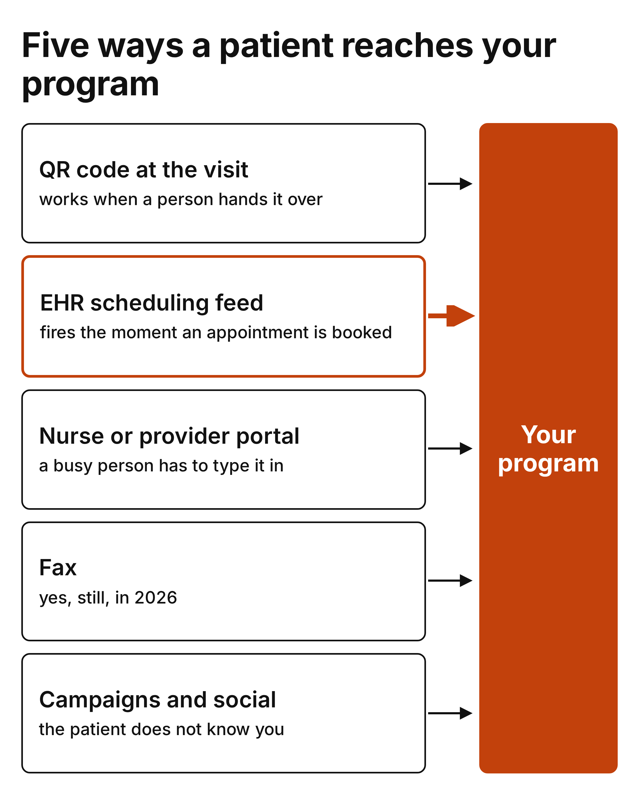
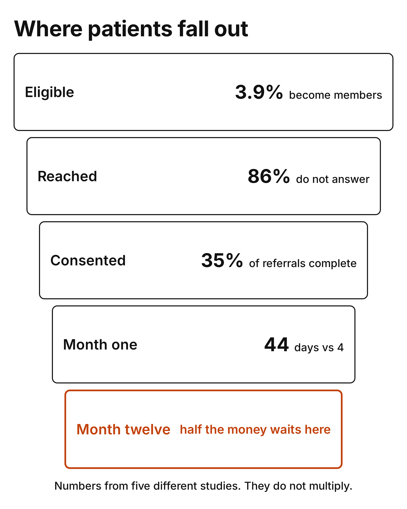
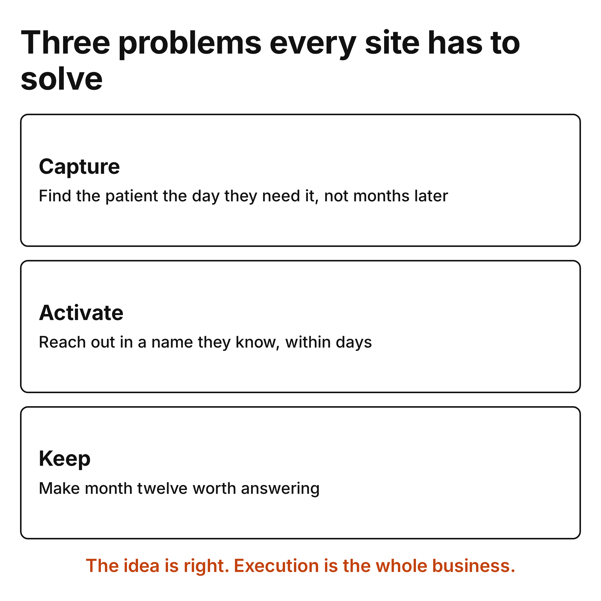
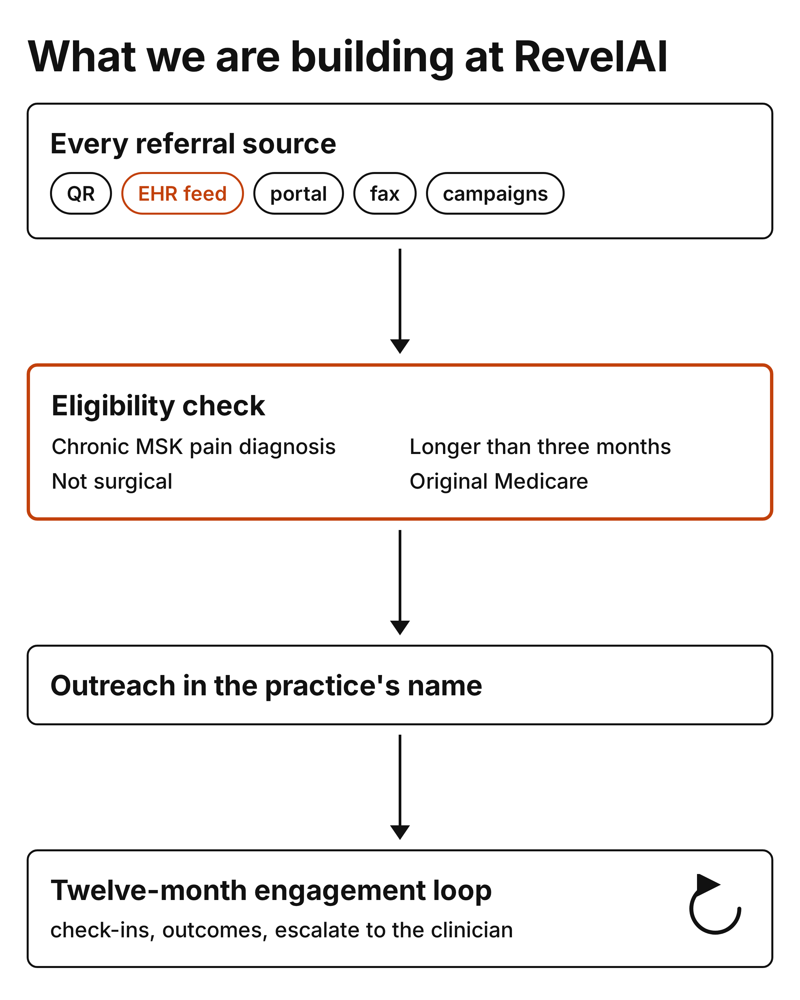

---
authors:
  - hjaveed
hide:
  - toc
date: 2026-08-25
readtime: 9
slug: cms-access-referrals-are-the-hard-part
comments: true
---

# CMS ACCESS: Getting the Patient in the Door Is the Hard Part

It's very hard to automate patient referrals into a digital health program. You'd think patients will see a program like CMS ACCESS online and onboard themselves, but there's a lot more to it.

We've spent the last year at [RevelAI Health](https://www.revelaihealth.com/){:target="_blank"} building for this model, and most of that time went into a problem that isn't in the RFA at all: how does a patient actually get into your program, and how do you keep them there for twelve months? I want to share how we think about it, what the evidence says, and what we're building.

<!-- more -->

## What ACCESS actually is

ACCESS stands for Advancing Chronic Care with Effective, Scalable Solutions. It's a CMS Innovation Center model for technology-enabled chronic care. It [launched on July 5, 2026](https://www.cms.gov/priorities/innovation/innovation-models/access){:target="_blank"} and runs for ten years. There are four tracks: cardiometabolic, early cardiometabolic, behavioral health, and musculoskeletal. We're in the MSK track.

A few things about the MSK track that matter for everything below:

- The patient has to have chronic musculoskeletal pain, longer than three months.
- Original Medicare only. No Medicare Advantage.
- Peri-surgical and post-surgical patients are excluded. These are the non-surgical patients.
- The payment is [\$180 per patient per year](https://www.cms.gov/priorities/innovation/files/access-payments-amts-perf-targets.pdf){:target="_blank"}. Half of it comes in monthly as you bill, and the other half is held back until the end of the year and paid based on whether patients actually improved on their pain and function scores.
- Patients who stop responding count against you. A blank scores the same as a patient who didn't get better.

We're on the [accepted participant list](https://www.cms.gov/priorities/innovation/access-model-accepted-applicants){:target="_blank"}, along with more than 150 other organizations. So this isn't analysis from the outside. Our next twelve months get graded on this.

I'm going to stay on the referral and engagement side here. My co-founder and our CEO, Christian Pean, has written a lot about the model itself, the policy, the tracks, the payment design, in his [12 Days of ACCESS series](https://techysurgeon.substack.com/t/12daysaccess){:target="_blank"}. If you want the full picture of ACCESS, start there.

## No referral required, in practice

The CMS page for clinicians says it plainly: [a referral is not required](https://www.cms.gov/priorities/innovation/access-primary-care-providers-referring-clinicians){:target="_blank"}. Patients can enroll on their own, by phone or online. The participant just has to validate the diagnosis from an assessment, a referral, or the chart.

When I first read that I thought, great, no gatekeeper, we can put the program online and patients will come. Honestly, that's not how it works. A month after launch, [STAT's headline](https://www.statnews.com/2026/08/06/cms-medicare-pilot-access-patient-info-health-tech/){:target="_blank"} was "Medicare pushes ACCESS but doesn't tell patients what providers offer it." There's no directory. And of the patients who do try to enroll, the RFA randomizes one in ten into a control group in the first year, where they sit for twelve months. You do the work of finding them, and CMS keeps a tenth for the study.

So there's no referral requirement, but that also means nobody is responsible for sending you the patient. We have to build those paths ourselves.

## Where patients actually come from

Here's every way a chronic MSK patient enters a program like ours. This is what we actually see, not the pitch-deck version.

- **A QR code in the clinic.** The medical assistant hands the patient a card, or it's printed on the after-visit summary. This works, but only when a person hands it over. In [one clinic study](https://pmc.ncbi.nlm.nih.gov/articles/PMC10949130/){:target="_blank"}, 91% of patients recruited in person signed up, versus 17% of the ones who saw a flyer in the same waiting room. I think the handoff by a person matters a lot more than the QR code itself.
- **The EHR scheduling feed.** Every EHR we've integrated with sends HL7 SIU messages when an appointment is booked, rescheduled, cancelled, or the patient doesn't show. ADT feeds do the same for admissions and discharges, and hospitals have been [required to send those](https://www.law.cornell.edu/cfr/text/42/482.24){:target="_blank"} since 2021. This is the only door where nobody has to remember anything. The system tells you, in real time, that a patient with knee pain was just scheduled for Thursday.
- **A nurse or provider portal.** We give the clinic a link and staff enter the patient. It's accurate and it's consented, but it depends on a busy person doing one more thing at the end of a fifteen-minute visit.
- **Fax.** Believe it or not, in 2026. [MGMA found](https://www.mgma.com/mgma-stats/time-warp-the-lingering-legacy-of-fax-in-medical-practices){:target="_blank"} 89% of practices still use fax, and referrals are one of the top uses. We run OCR on referral faxes every week. (Side note: the stat everyone quotes, that 75% of medical communication happens by fax, has no source. It traces back to an unnamed estimate in a 2017 news story. Don't put it in your deck.)
- **Campaigns.** Social ads, mailers, the practice newsletter, whatever you or your client is running. The clicks look cheap, the cost per enrolled patient usually isn't. One trial that had to screen and consent people from ads [paid about \$88 per enrolled participant](https://pmc.ncbi.nlm.nih.gov/articles/PMC10667016/){:target="_blank"}. And the bigger problem isn't the cost. The patient who clicks an ad doesn't know you, and in a program that needs twelve months of answers, that matters more than anything.

At the end of the day, who wins here? I don't think it's the program with the best app. I think it's the program that's wired into the most doors, and leans hardest on the one that fires by itself.

## Where patients fall out

Every one of those doors feeds the same funnel, and the funnel is brutal. I put the best number I could find behind each stage. These come from five different studies and populations, so don't multiply them together. They're here to set expectations.

- **Eligible.** Hinge Health, the only public digital MSK company, [reports](https://s205.q4cdn.com/978984498/files/doc_news/Hinge-Health-reports-fourth-quarter-and-full-year-2025-financial-results-2026.pdf){:target="_blank"} that 3.9% of eligible lives became members last year. That's a company with a decade of practice and employer distribution. Start your model there, not at 30%.
- **Reached.** [86% of people](https://work.hiya.com/hubfs/2026/Hiya_SotC_2026_FINAL.pdf){:target="_blank"} say they don't answer calls from numbers they don't know. Patients don't respond to cold outreach anymore. They hate it. And texting isn't the escape hatch people think it is. The [largest study of SMS nudges](https://www.pnas.org/doi/10.1073/pnas.2101165118){:target="_blank"} moved flu shots by a couple of percentage points, and that was with patients who already had an appointment and knew the sender.
- **Consented.** Even when a doctor writes the referral, the loop doesn't close. In a [study of over 100,000 referrals](https://pubmed.ncbi.nlm.nih.gov/29532299/){:target="_blank"}, only about a third ended in a documented completed visit, and most of the rest never had an appointment date at all. (Another side note: the "half of all referrals never get completed" line usually cites a 2000 paper that doesn't contain a completion rate. Self-reported studies find closer to 80%. I think the difference mostly comes down to how each study counts a completed referral.)
- **Month one.** This is the number I keep coming back to. Across eight digital health studies and over 100,000 participants, [median retention was 44 days](https://pmc.ncbi.nlm.nih.gov/articles/PMC7026051/){:target="_blank"} when a clinician referred the patient, and 4 days when the person found the app on their own. It's observational, and those are different kinds of patients, so I read it as a direction rather than a multiplier. But it's a big direction. And ACCESS puts a clock on it: the RFA requires baseline measures within a set number of days of enrollment to keep the patient enrolled at all.
- **Month twelve.** Half the money waits here. A patient who stopped answering in month seven scores the same as a patient who didn't improve.

## Three problems sites will have to solve for

I think every site in this model will have to solve for three problems. I haven't seen anyone solve all three yet, us included, but I'm fairly sure this is the shape of it.

**Can you capture the patient at the right time?** The need isn't spread evenly across the year. It's highest on the day the patient is in the clinic, or the day the imaging came back, or the day they got scheduled. An old roster tells you who qualifies, it doesn't tell you who's hurting today.

**Can you activate them?** Patients don't respond to cold outreach anymore, so can there be a warm handoff? Honestly, the evidence on warm handoffs is messier than the slogan. [One study](https://www.jahonline.org/article/S1054-139X%2823%2900142-8/abstract){:target="_blank"} found a warm handoff tripled the odds a patient engaged. [A bigger one](https://www.annfammed.org/content/16/4/346){:target="_blank"} found it made no difference. What both agree on is speed: contact within days, not weeks, is what predicted whether the patient showed up. My current view is that the patient needs to hear from a name they recognize, and it needs to happen within days. A patient who got discharged six months ago, will they even remember their provider if they're not seeing them anymore? A patient scheduled for Thursday will.

**Can you keep them engaged for the whole continuum?** Twelve months is a long time to keep answering questions from a program. A few things I believe move it:

- Cadence. In the [Medicare Diabetes Prevention Program evaluation](https://www.cms.gov/priorities/innovation/data-and-reports/2025/mdpp-finalevalrpt){:target="_blank"}, participants said the weekly rhythm was what kept them accountable, and drop-off got bad once sessions went monthly.
- Closing the loop. Patients keep reporting when they can see what their reporting changed. I wrote about this in the [self-reporting stack post](/2025/09/16/building-a-patient-self-reporting-stack/).
- Some reward or monetary value, carefully. [Small incentives work while you pay them](https://pubmed.ncbi.nlm.nih.gov/31092399/){:target="_blank"}, and the evidence on what happens after you stop is split. My bet is on the other two: are you actually helping them recover, and is there a real connection to their provider? If the answer is no, no amount of gift cards fixes it.

## About the negative sentiment

There's a lot of negative sentiment about ACCESS because of the reimbursement. I get it. \$15 a month, \$12 after you waive the coinsurance, isn't a lot to run a clinical program on. Capstone's analysts [predicted negative margins](https://www.fiercehealthcare.com/digital-health/low-pay-rates-medicares-access-model-will-pressure-digital-health-margins-capstone){:target="_blank"} for anyone who needs volume. Omada's president said the rates don't cover the cost of delivering their care. The one company that [sounded comfortable](https://www.fiercehealthcare.com/health-tech/deeper-dive-access-model-whos-participating-potential-headwinds-and-how-it-could-spur){:target="_blank"}, Withings, credited "little to no marketing costs".

The Withings comment is the one that stuck with me. We can't change the rate. What we can change is what it costs to get a patient in and keep them, and that number isn't in the RFA because it's not CMS's problem, it's ours. If you pay \$88 to enroll a patient from an ad and lose them on day four, you lost the year before you delivered any care. If the same patient surfaced from a scheduling feed you already had, the acquisition cost is a text message.

So yes, the reimbursement is bad if you're buying patients. But this model is one of a kind if we can solve for technology-based engagement with patients. It's the first Medicare program I've seen where patient engagement is what actually gets paid for, and that's a problem we've already spent years on. That's why we applied.

## What we're building at RevelAI

We decided early that we'd solve for every referral source, because no site has just one. QR at the visit, the provider portal, the fax line, the practice's own campaigns.. all of it lands in the same intake and the same consent flow.

The door we're betting on is the EHR feed. We've been consuming HL7 SIU scheduling and surgery feeds from orthopedic practices for years, because that's how you know a knee replacement is coming before the patient does. ACCESS changes what we need from the feed. These are the non-surgical patients, so the surgery feed is the wrong signal.

So the work this year has been an eligibility engine that treats the appointment feed as the trigger, joins it to the chart and the coverage check, and answers four questions without a human:

1. Is the diagnosis chronic musculoskeletal pain? We map the ICD-10 families for low back pain, hip and knee osteoarthritis, chronic joint pain, and chronic pain syndromes.
2. Has it lasted more than three months?
3. Is this patient peri- or post-surgical? If yes, they're out.
4. Is the coverage Original Medicare Parts A and B?

Get those four right and the outreach list writes itself the moment the schedule updates. Get one wrong and you're calling a patient two weeks after her hip replacement about a program she can't join.

The second piece is branding. Patients don't know RevelAI and they shouldn't have to. We're working with our partners on agreements to run the program under the practice's name, so the text that lands says the orthopedic group the patient saw on Thursday, not a vendor. That's the closest thing to a warm handoff you can automate, and it's the one that survives the evidence.

The third piece is the one I care most about as an engineer: an engagement loop that holds for twelve months. Check-ins that adapt to where the patient is, outcome measures collected in pieces instead of one long form, recovery guidance that reads like it came from the clinic, and escalation to a real clinician when the numbers move the wrong way. The clinician doesn't have to do the engagement. They have to be reachable when it matters, and they have to be the name on the message.

## Final thoughts

The idea behind ACCESS is right, and execution is hard. Most of the hard part happens before any care is delivered.. finding the patient at the right moment, getting a yes from someone they trust, and keeping them for a year. We're building those paths one referral source at a time, and we're still learning.

If you're building for ACCESS, or running an orthopedic or PT practice and thinking about it, I'd love to compare notes.
