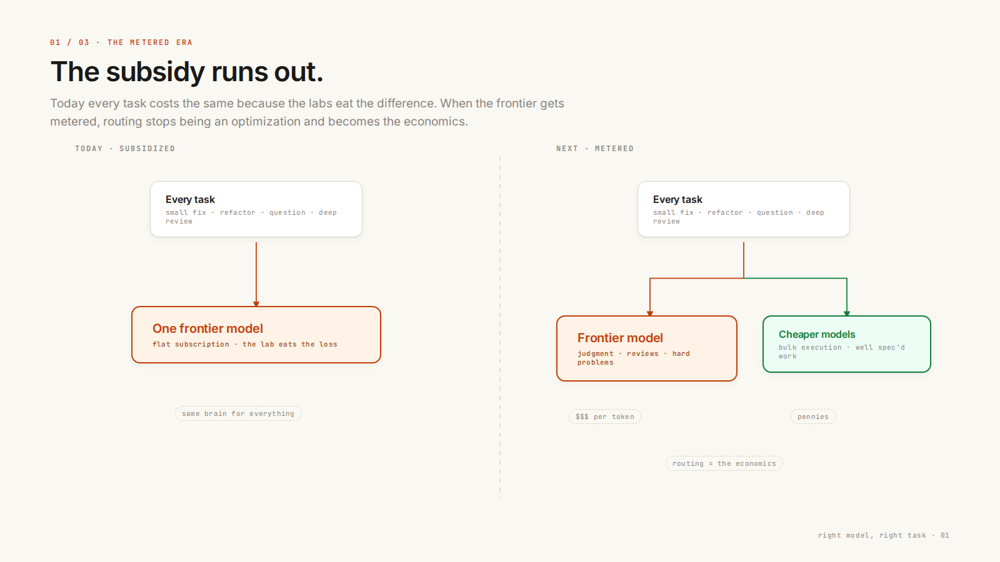
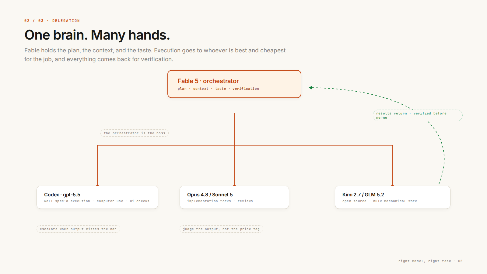
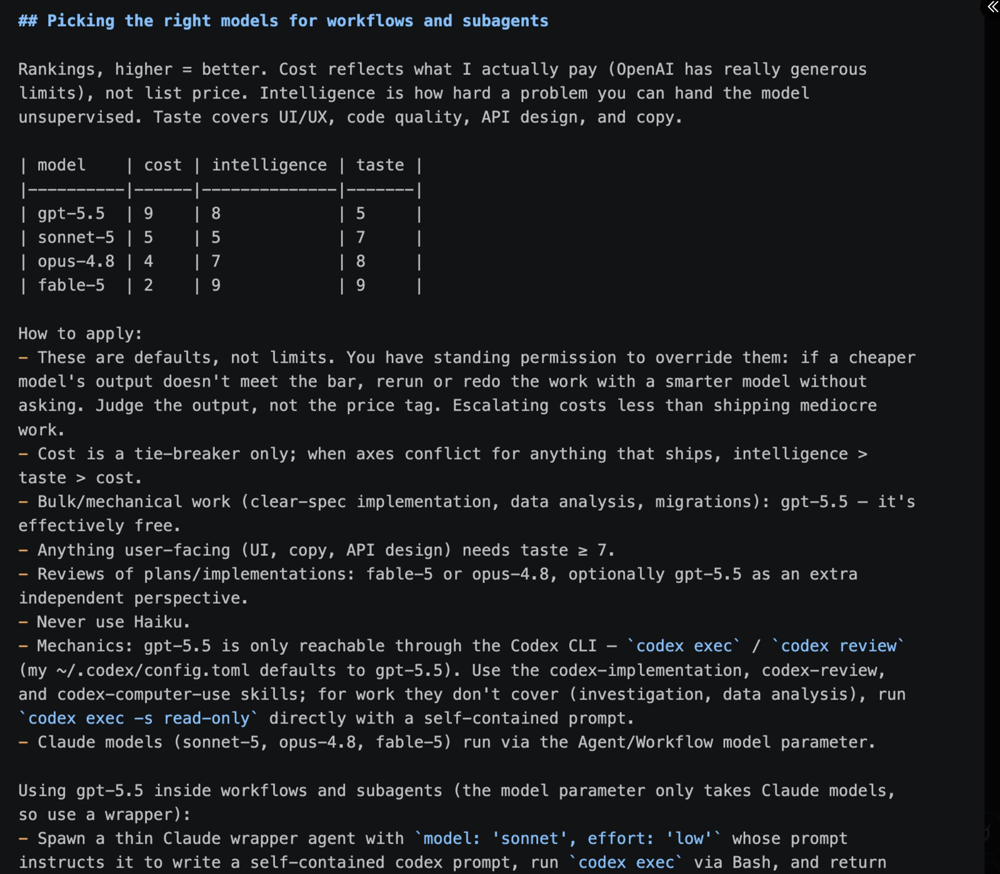
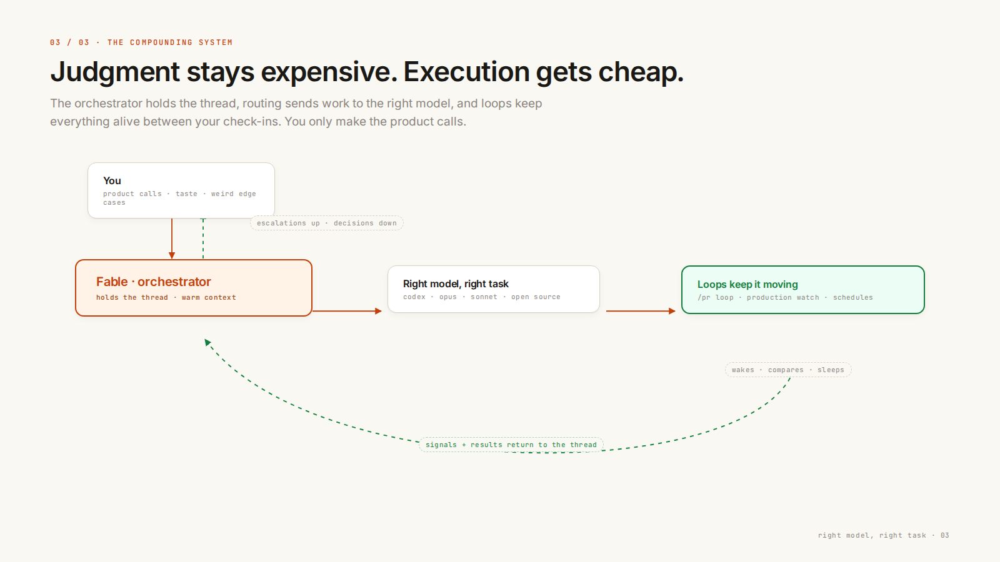

---
authors:
  - hjaveed
hide:
  - toc
date: 2026-07-08
readtime: 6
slug: fable-5-right-model-right-task
comments: true
---

# The LLM Router Era Starts with Fable 5

Fable 5 is the most incredible model I have used. Not a nicer version of the last one. Another level of increment in capability.

But that is not the part that stuck with me. After days of heavy use, the thing I keep noticing is not what Fable does. It is what Fable chooses not to do itself.

It delegates. And it is good at it. That is the first real glimpse of something I have been waiting for: the LLM router era. This post is the thesis and the playbook: why routing is about to become the default economics, and the exact skill I use to make Fable route work to cheaper models.

<!-- more -->

## What actually makes Fable different

Benchmarks will not tell you this. What you feel in practice is judgment:

- It holds a long thread without drifting
- It knows when a task deserves its full attention and when a cheaper model can grind through it
- It verifies work instead of declaring victory

That last one is the unlock. A model you can trust to check other models' work is a model you can put in charge.

## Your subscription is a loss leader

Here is the uncomfortable math. Anthropic and OpenAI are subsidizing most of the model usage happening today. You are not paying what your tokens cost.

That does not last. I believe the next generation of best-in-class models will be metered by API usage. They will not live comfortably inside any subscription under $200. The frontier is getting too expensive to hand out flat-rate.



When that happens, "use the right model for the right task" stops being a power-user trick. It becomes the only economics that make sense. Paying frontier prices for grunt work will feel like hiring a staff engineer to rename variables.

Plenty of software factory products claim they have routing figured out already. I have not seen Devin, Droid, or any of the others truly nail it. The router was never going to be a traffic cop with a lookup table. It was always going to be the smartest model in the room. Fable is the first model with enough judgment to play that role.

So how do you actually run it that way? There is a name for the pattern.

## Plan big, execute small

Anthropic published a recipe in their official [Claude Cookbooks](https://github.com/anthropics/claude-cookbooks){:target="\_blank"} called [Plan big, execute small](https://github.com/anthropics/claude-cookbooks/blob/main/managed_agents/CMA_plan_big_execute_small.ipynb){:target="\_blank"}, and it reframed how I think about cost. The expensive model is the coordinator. It plans, decomposes, verifies, and synthesizes. Everything token-heavy, reading files, searching code, trawling logs, fetching docs, gets fanned out to cheaper worker models running in parallel.

The counterintuitive part: the savings do not come from reading less. In the cookbook's own measurements, the split team read roughly the same volume as a solo frontier agent but came out 2.5x cheaper and 3x faster, because 84-98% of the input tokens were billed at the worker rate.

It is rate arbitrage, not rationing:

| Model    | Input $/M | Output $/M | Role                                             |
| -------- | --------- | ---------- | ------------------------------------------------ |
| Fable 5  | $10       | $50        | Coordinator: plan, decompose, verify, synthesize |
| Opus 4.8 | $5        | $25        | Worker for reasoning-heavy sub-tasks             |
| Sonnet 5 | $3        | $15        | Default worker: reading, searching, transforms   |

Every token a Sonnet worker reads instead of Fable is a 3-5x saving on that token. And it compounds: whatever lands in the coordinator's context gets re-sent on every subsequent turn.

In practice the pattern is four moves:

1. Classify the work. Judgment stays with the coordinator: the approach, conflict resolution between reports, the final deliverable. Mechanical work gets delegated: anything where the procedure is clear and the cost is in volume.
2. Fan out in parallel. Spawn workers with an explicit cheap model, all at once, not one at a time.
3. Write real briefs. Workers know nothing you do not put in the prompt. Each brief needs one self-contained question, rigor instructions (cheap models default to shallow), a required evidence format like file:line references and quotes, and a size cap so reports do not flood the coordinator.
4. Synthesize at the top. Read only the reports, never re-read what workers already read. That pays the expensive rate twice and defeats the whole pattern.

And the ways people screw it up, straight from the cookbook's measurements:

- Over-sharding. Every worker pays a bootstrap cost. Twenty micro-briefs cost more than the solo agent. 3-6 meaty workers beat 20 tiny ones
- Delegating judgment. Architecture decisions and final synthesis on a cheap model is saving money in the wrong place
- Cutting rigor to cut cost. An agent that reads less is a worse product, not a cheaper equivalent. Keep the rigor, move it to the cheap rate

## My setup right now

Fable is the orchestrator. It holds the plan, the context, and the taste. Everything else is a worker:

- Codex (gpt-5.6) for well spec'd execution, computer use, and UI/UX verification. It is still WAY better at driving a browser and checking visual work
- Opus 4.8 or Sonnet 5 for focused implementation forks, reviews, and all the mechanical reading
- Kimi 2.7 or GLM 5.2 if you are running an open source setup



[Theo](https://x.com/theo){:target="\_blank"} has been minmaxing exactly this, and his CLAUDE.md is the best concrete version I have seen. He scores every model on cost, intelligence, and taste, then routes accordingly: bulk mechanical work to gpt-5.6 because it is effectively free on his plan, anything user-facing to models with taste, reviews to Fable or Opus.



The result, in his words: he was throwing away about 50% of his end-to-end agent-driven PRs before this workflow. After it, he did not close a single one. Read his [strategy post](https://x.com/theo){:target="\_blank"}.

My favorite rule from his setup: the rankings are defaults, not limits. If a cheaper model's output misses the bar, escalate without asking. Judge the output, not the price tag. Escalating costs less than shipping mediocre work.

## Steal the skill

Everything above is encoded in one Claude Code skill I use daily, built directly on Anthropic's [Plan big, execute small cookbook recipe](https://github.com/anthropics/claude-cookbooks/blob/main/managed_agents/CMA_plan_big_execute_small.ipynb){:target="\_blank"}. To install it globally so it works in every project:

```bash
mkdir -p ~/.claude/skills/plan-big-execute-small
```

Then save the markdown below as `~/.claude/skills/plan-big-execute-small/SKILL.md`. For a single repo, put it in `.claude/skills/plan-big-execute-small/SKILL.md` at the project root instead. And if you do not want a skill at all, paste the body straight into your global `~/.claude/CLAUDE.md` or the project's `CLAUDE.md` and it works as standing instructions.

Trigger it with `/pbes` or just say "do this cheaply". It also kicks in on its own when a task involves pulling large volumes of content through the model.

````markdown
---
name: plan-big-execute-small
description: Cost-saving delegation harness based on Anthropic's "plan big, execute small" cookbook. Keep planning, judgment, and synthesis on the expensive main model (Fable); fan out mechanical token-heavy work (bulk file reads, code searches, web research, log trawls, per-item transforms, doc summarization) to Opus 4.8 subagents (default worker tier; Sonnet 5 allowed for rote volume, NEVER Haiku — quality floor set by Hadi). Also treat OpenAI Codex (gpt-5.6-sol, xhigh reasoning, via `codex exec`) as a peer work-agent for backend implementation, deep debugging, web research, and cross-vendor second opinions — it bills to the OpenAI plan, not Claude tokens. NO worktrees ever: all work happens in the main checkout, one writer at a time. Trigger when the user says "/pbes", "do this cheaply", "save tokens", "frugal mode", "delegate to codex", or when a task involves pulling large volumes of content (many files, many web pages, long logs) through the model.
---

# Plan Big, Execute Small

You (the main loop, running an expensive frontier model) are the **coordinator**. Your tokens cost 3–10x more than a subagent's. The single biggest cost driver in agentic work is _mechanical reading_ — files, web pages, logs, search results pulled into context. Move that reading onto cheaper workers; keep only planning, judgment, and synthesis here.

**Key insight from the cookbook:** the savings come from **rate arbitrage, not reading less**. Both approaches read roughly the same volume — the split team was 2.5x cheaper and 3x faster because 84–98% of input tokens were billed at the worker rate, and workers ran in parallel. Do NOT respond to cost pressure by skimping on rigor; respond by changing _who_ reads.

## Standing rules (Hadi's preferences)

- **NO worktrees, ever.** Not for you, not for Codex, not for subagents. All work happens in the main checkout, main thread. Worktrees are confusing — never call EnterWorktree, never pass `isolation: 'worktree'`, never `-C` Codex into a worktree.
- **One writer at a time** (this replaces worktree isolation): never let two things edit files simultaneously. When Codex implements, you don't touch files until it's done. When you implement, Codex runs read-only (`-s read-only`). Investigation subagents are read-only by nature — always safe in parallel.
- **Quality floor: never Haiku workers.** Opus 4.8 is the default worker tier; Sonnet 5 is allowed for truly rote high-volume reading.
- Hadi commits himself — don't commit unless he asks.

## Rate table (why this works)

| Model                   | Input $/M            | Output $/M        | Role                                                                                       |
| ----------------------- | -------------------- | ----------------- | ------------------------------------------------------------------------------------------ |
| Fable 5                 | $10                  | $50               | Coordinator: plan, decompose, verify, synthesize, review every diff                        |
| Opus 4.8                | $5                   | $25               | **Default worker**: reading, searching, web research, transforms, debugging                |
| Sonnet 5                | $3 ($2 intro)        | $15 ($10 intro)   | Optional tier for truly rote volume reading                                                |
| Codex gpt-5.6-sol xhigh | bills to OpenAI plan | ~$0 Claude tokens | **Peer work-agent**: backend implementation, deep debugging, web research, second opinions |

Every token a worker reads instead of you is a 2–5x saving on that token (or ~free, for Codex). It also keeps your own transcript small, which compounds: your context is re-sent (cache-read billed) on every subsequent turn.

## Step 1 — Classify the work

Before acting, split the task into:

- **Judgment work** (stays here): understanding the ask, decomposing into sub-questions, deciding the approach, resolving conflicts between worker reports, verifying suspicious findings, reviewing diffs, writing the final deliverable.
- **Mechanical volume** (→ Opus subagents): anything where the _procedure_ is clear and the cost is in volume — read N files and report X, search the web for Y and return evidence, trawl logs for pattern Z, apply the same transform to each item, summarize each document.
- **Deep self-contained units** (→ Codex): one gnarly, well-specifiable problem — implement a backend module/endpoint/migration, root-cause a hard bug, a meaty research question, a design second opinion. Quality work, not volume work.

If the whole task is mechanical and small (one grep, one file read), just do it — delegation has a floor (see anti-patterns).

## Step 2 — Fan out with the Agent tool

Spawn workers with an explicit `model`, in parallel (one message, multiple Agent calls), in the background:

- `subagent_type: "Explore"` + `model: "opus"` — codebase searches and file-location sweeps.
- `subagent_type: "general-purpose"` + `model: "opus"` — web research, multi-file reading, per-item transforms, debugging.
- **Opus 4.8 is the default worker tier.** Drop to `model: "sonnet"` only for truly rote high-volume reading where reasoning doesn't matter. Never `model: "haiku"` (quality floor); never spawn `fable` workers (no arbitrage).

For large structured fan-outs (10+ items, multi-stage, verify passes) — and only when the user has opted into multi-agent orchestration — use the Workflow tool instead, with per-agent overrides: `agent(prompt, {model: 'opus'})` for worker stages; leave `model` unset (inherit) only for the final judge/synthesis stage. Never pass `isolation: 'worktree'`.

## Step 2b — Collaborate with Codex (peer work-agent)

OpenAI Codex CLI is installed and authenticated (`codex` on PATH, default model gpt-5.6-sol at xhigh reasoning). It's a **peer, not a subordinate**: strong at backend implementation, deep debugging, web research, and algorithmic work. It bills to Hadi's OpenAI plan — a Codex delegation costs ~zero Claude tokens (just your brief and its report).

**Invocation** (always via Bash, always `run_in_background: true` — xhigh takes minutes):

```bash
codex exec --skip-git-repo-check \
  -o /path/to/tmp/codex-report.md \   # final report → file; read ONLY that file
  -s read-only \                       # include whenever it must not edit files
  "<self-contained brief>" </dev/null
```

- `-o` / `--output-last-message` keeps its report out of your context until you choose to read it.
- `--output-schema schema.json` when you need structured JSON back.
- `-s read-only` for review/research/consult briefs; omit (workspace-write) only when Codex is the designated writer.
- It works in the **main checkout** (no worktrees) — which is why the one-writer rule above is load-bearing.
- Briefs follow the same discipline as Step 3: Codex sees nothing of your conversation, has no access to Claude-side MCP tools (Linear, Slack, byaan, fino…), so the brief must carry the full spec, constraints, file paths, and acceptance criteria.

**Collaboration patterns:**

1. **Backend implementer** — you write the spec + acceptance criteria into the brief; Codex implements in the main checkout (you hands-off files meanwhile); you review with `git diff` and run verification. Hadi commits.
2. **Cross-vendor reviewer** — you implement, Codex reviews read-only (`codex exec review` inside a repo, or a "try to refute this diff" brief). Different model families catch different bugs.
3. **Research peer** — for meaty questions, fire Codex AND an Opus subagent on the same question in parallel, then triangulate. Two independent takes beat one.
4. **xhigh consultant** — gnarly bug or design decision: pack the evidence into a brief, let it reason deeply, judge its answer against your own read.

## Step 3 — Write worker briefs correctly

Workers know NOTHING you don't put in the prompt — not the conversation, not your plan, not the other workers' briefs. From the cookbook: "Everything the coordinator believes about its workers comes from its own system prompt." (This applies doubly to Codex, which is a different vendor entirely.)

Each brief must contain:

1. **One focused sub-question** — self-contained, no references to "the task above".
2. **Rigor instructions** — "try multiple query phrasings / search patterns, follow promising leads, cross-check across sources." Workers default to shallow; the brief supplies the rigor.
3. **An evidence-bearing report format** — require `file:line` references, URLs, verbatim quotes, exact values. You will verify from evidence, not by re-reading the sources yourself. Ask for structured findings (a list of facts + evidence), NOT polished prose.
4. **A size cap** — "report at most N findings / keep the report under ~500 words" so worker output doesn't flood your context.

## Step 4 — Synthesize and verify here

- Read only the reports. Do not re-read what workers already read — that pays the expensive rate twice and defeats the pattern.
- Review every diff (yours or Codex's) at the expensive rate — but only the diff, not the whole tree.
- Spot-check: if a finding is load-bearing and the evidence looks thin, send ONE targeted verification (a single file read, a cheap verify-subagent with a refute-this brief, or a read-only Codex cross-check) rather than redoing the sweep.
- Conflicting reports → resolve with judgment here, or spawn one tie-breaker worker with both claims and their evidence.

## Anti-patterns (from the cookbook's measurements)

- **Over-sharding.** Delegation has a floor: each worker pays a bootstrap cost (system prompt + brief + report). Narrowly-scoped micro-briefs _increased_ total cost in the cookbook's tests. A brief should represent at least several tool calls' worth of mechanical work. 3–6 meaty workers beat 20 tiny ones.
- **Delegating judgment.** Final synthesis, architecture decisions, security-sensitive conclusions, diff review, and anything needing the full conversation context stay on the main model. That's what the expensive tokens are _for_.
- **Two writers at once.** You and Codex (or any two writers) editing the same checkout simultaneously — there is no worktree isolation, so sequence it or make one side read-only.
- **Using Codex for volume.** Codex xhigh is slow and deep — wrong tool for "read these 40 files" (that's an Opus subagent's job); right tool for one hard, self-contained problem.
- **Prose reports.** Workers returning essays waste their output tokens and your input tokens. Demand structured findings + evidence.
- **Cutting rigor to cut cost.** A solo agent that "reads less" is a lower-rigor product, not a cheaper equivalent. Keep the rigor; move it to the cheap rate.
- **Doing the sweep yourself first "to understand it".** Scout minimally (list files, scope the diff — cheap), then delegate the heavy reading. Don't pull 50 files into your own context and then also spawn workers.

## Cheap-by-default habits (apply even without fan-out)

- Noisy investigation (grep sweeps, log trawls, broad search) → always a subagent; keep only the conclusion in the main transcript.
- Long web pages / docs → an `opus` worker fetches and distills; you read the distillation.
- A meaty self-contained question with no urgency → consider firing a background Codex run in parallel with your own work; its answer costs no Claude tokens.
- When the user asks for a quick answer, answer directly — this skill is for volume, not for adding ceremony to small tasks.
````

## Add loops and it compounds

Routing decides who does the work. Loops decide when it happens. I wrote about this in [Agent Workflows & Loops](agent-workflows-and-loops.md), and Anthropic just published a solid primer on [getting started with loops](https://x.com/ClaudeDevs/status/2074208949205881033){:target="\_blank"}.

Put the two together and you get the shape I think this job is settling into:



The orchestrator keeps the context warm. Cheap models grind through the passes. Loops keep everything moving while you sleep. Your attention goes to product calls and the weird edge cases, not to being the cron job for your own codebase.

## The new shape of the job

Fable is the first model where delegation feels less like a workaround and more like the architecture. The frontier model becomes the staff engineer you pay a premium for, managing a team of cheaper, faster, good-enough models.

Judgment stays expensive and centralized. Execution gets cheap and distributed. That is the LLM router era, and we are just getting the first glimpse of it.

It is also the most fun I have had building in years.
