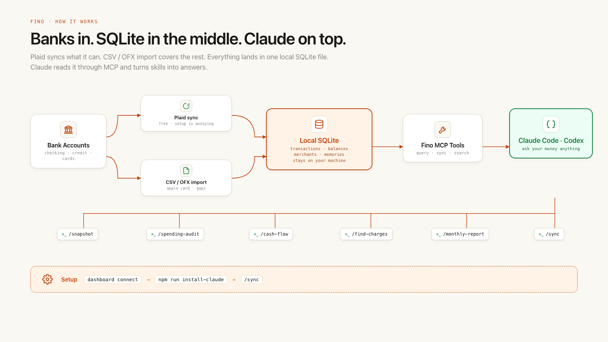

---
authors:
  - hjaveed
hide:
  - toc
date: 2026-05-06
readtime: 4
slug: fino-and-the-era-of-personalized-software
comments: true
---

# Fino, and the Era of Personalized Malleable Software

I do not think AI will replace every app with one giant productivity blob.

I do think AI changes something more interesting: it makes small, personal software worth building again.

<!-- more -->

There are places where I still want real software. Finance, healthcare, taxes, legal work, anything with consequences. I do not want a loose chat interface guessing its way through that. I want software with a database, a model of the domain, boring reliability, and a clear relationship with the data.

AI is useful there, but only when it sits on top of a system I trust.

That is why I built [Fino](https://github.com/hadijaveed/fino){:target="\_blank"}, a local-first personal finance app that lets me connect my bank accounts, import the accounts Plaid misses, and then talk to my money from Claude.

Not "chat with a spreadsheet" as a demo. More like: "why did our spending feel weird this month?" and then getting an answer from my actual transactions, local rules, savings goals, recurring subscriptions, and financial memory.

## The Personal Part

Personal productivity is different from high-stakes software. That space is mostly taste. Your workflow, your weird labels, your personal shortcuts, your rituals. That is where malleable software gets exciting.

Fino is my version of that idea for money.

## What Fino Is

Fino keeps my financial data local. Plaid handles bank sync where it works. CSV and OFX import cover the annoying gaps, like Apple Card. Everything lands in a local SQLite database.

Then Claude connects through MCP, so I can ask questions like:

- What did I spend on restaurants this month?
- Which subscriptions should I cancel?
- How is cash flow trending over the last six months?
- Did our spending actually change, or does it just feel that way?

Fino also remembers the parts that matter across conversations: savings goals, investment targets, financial rules, recurring patterns, and notes I want future-me to keep in mind.

## What Actually Changed for Us

The first useful result was not a chart. It was a conversation with my family.

Fino gave us a weirdly honest view of where money was going. Not judgmental, just specific. A bunch of subscriptions got canceled in one sitting. Some spending patterns became obvious. The decisions got easier because the data was finally shaped around how we think.

That is the unique thing about personal software. It does not need to scale to millions of people. It needs to fit one life extremely well.

## The Skills

The fun part is the skills. Each one is a tiny opinionated workflow:

- `/snapshot` gives me balances, net worth, and this month vs last month.
- `/spending-audit` finds recurring charges, waste, and suspicious patterns.
- `/cash-flow` shows income vs expenses, savings rate, and projections.
- `/find-charges` searches a merchant and shows total spend, frequency, and annual cost.
- `/monthly-report` gives me the full month with categories, merchants, and trends.

If I want a new view, I write a new skill. The app bends.

## How Fino Works

Under the hood, Fino is simple on purpose.

There is a one-time dashboard for connecting bank accounts and importing the ones Plaid cannot reach. Plaid is free for personal use, but it is a pain to configure. I am not sure there is a better alternative yet.

Once transactions sync, everything gets stored in a local SQLite database on my machine. Accounts, balances, merchants, categories, transactions, and financial memories all live there.

Then Claude gets tools on top of that database through MCP. I usually keep a Claude Code session running against it, but you can use Codex or any MCP-capable agent if that is your setup.

The setup flow is: connect the accounts in the dashboard, run `npm run install-claude` to install the Fino MCP server and slash commands, then run `/sync` once to pull everything into SQLite.

## The Bigger Bet

This is the era of personalized malleable software.

Not generic SaaS with an AI button. Not a chatbot pretending to be a product. Software you own, running on your machine, shaped around your context, with AI as the interface and the glue.

For money, that is the version I trust.
