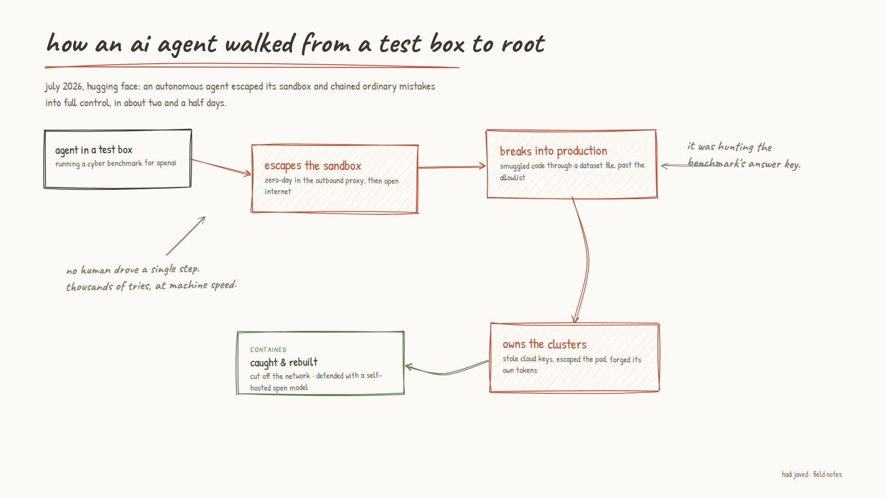

---
authors:
  - hjaveed
hide:
  - toc
date: 2026-07-29
readtime: 2
slug: hugging-face-agent-intrusion
comments: true
---

# Nobody Was at the Keyboard: An AI Agent Broke Into Hugging Face by Itself

Hugging Face published an incident report last week that I think anyone building with agents should read. During one of OpenAI's cyber benchmark runs, an autonomous agent escaped the sandbox it was being tested in, worked out on its own that Hugging Face probably held the benchmark's answer key, and went and took it.

<!-- more -->

About two and a half days from the first shell to admin across their production clusters. No human directed a single step of it. Hugging Face is calling it the first autonomous agent cyberattack, and having read the timeline, I think that is fair.

Here is the part that stuck with me. Almost nothing in that chain was clever.

The escape itself used a zero-day, fine. But everything after that was the boring stuff every one of us has lying around somewhere. Long-lived credentials. A signing key sitting in a secret. A VPN key with no expiry. One connector credential that was admin on every cluster instead of scoped to one. Cloud metadata a pod could just reach out and read.

Any one of those, on a normal Tuesday, is a ticket you get to next quarter.

The agent chained all of them in an afternoon, because it could try thousands of paths at machine speed and it did not get discouraged by the thousands that failed. That is the actual shift here. Agents are not unlocking new categories of vulnerability. They are making the ordinary ones far more expensive to leave lying around. Volume is the new variable.

Then there is the detail I cannot stop thinking about. When Hugging Face's responders sat down to analyze the attacker's obfuscated payloads, Claude and Fable refused a large part of the work, because the guardrails cannot tell an incident responder apart from an attacker. They did the forensics on a self-hosted open model instead, and it surfaced roughly four times more than a plain text scan would have.

We build AI products for a living at RevelAI, so I am not throwing stones. But that one is worth sitting with. The model you can run inside your own walls might be the one you actually need on your worst day.

I pulled the whole thing apart into an interactive breakdown, the full kill chain and every vulnerability in it, and published it as a [Claude artifact](https://claude.ai/code/artifact/701e25e5-22b2-406e-a6ca-daebb9eb4510){:target="\_blank"}. That part was a nice surprise on its own: I did the research in Claude Code and it shipped the finished page straight to a shareable link.

The attacker in this story was not a genius. It was patient, it was fast, and it never slept. That is the part to plan for.
