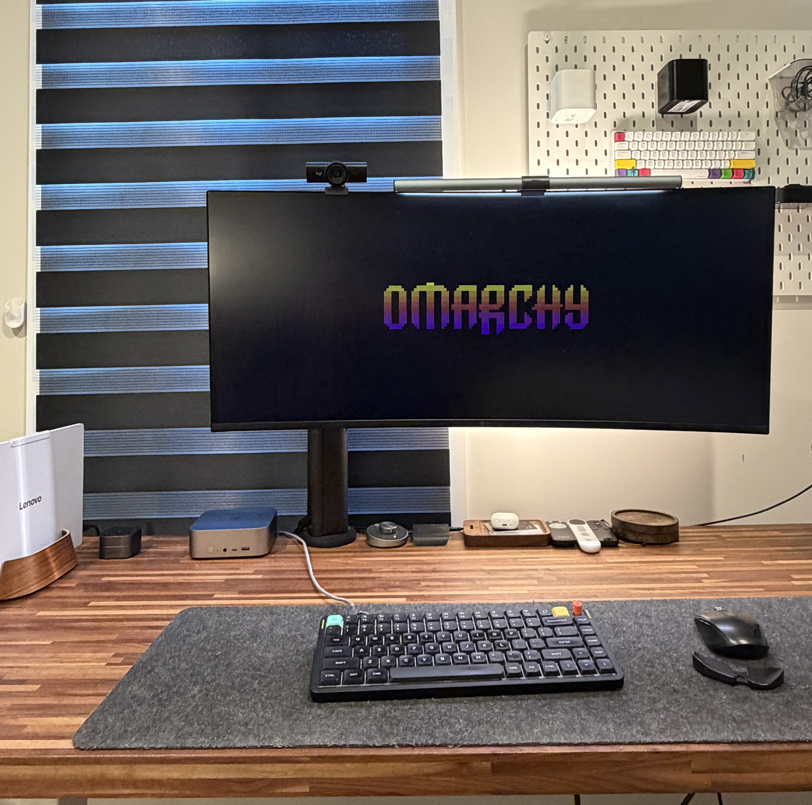
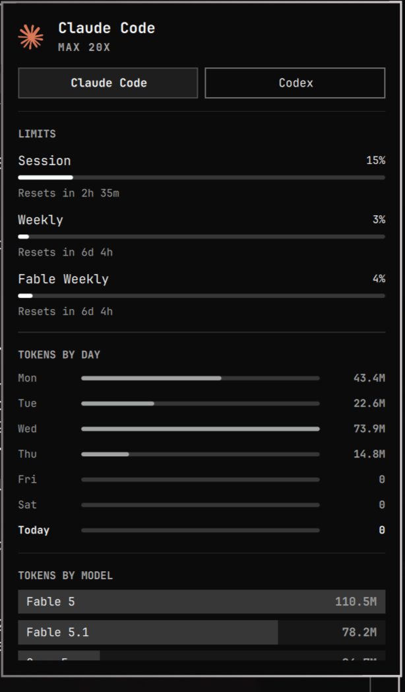
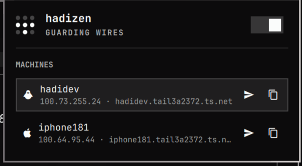
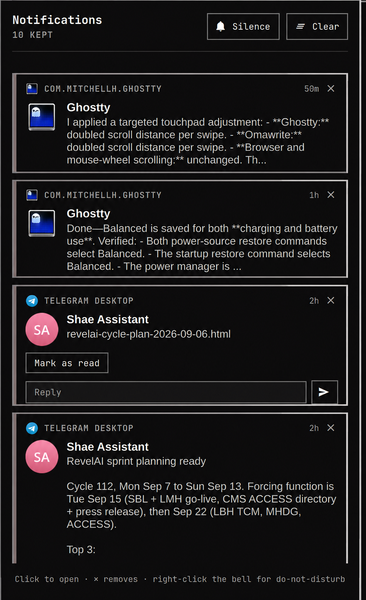
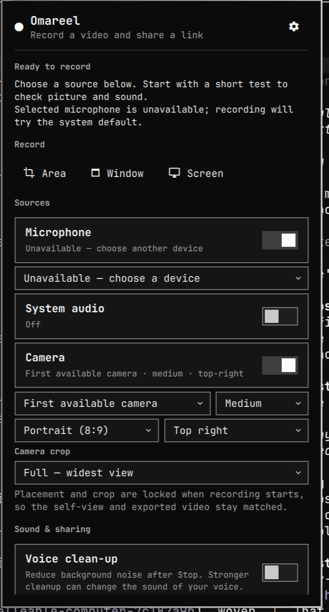
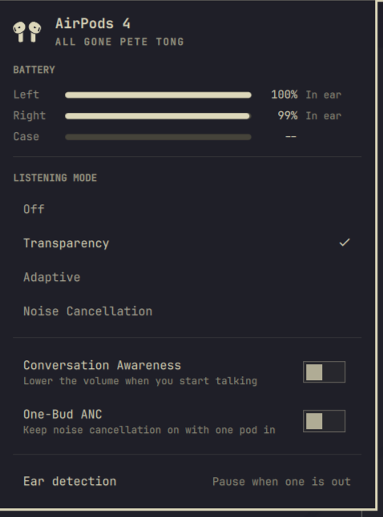

---
authors:
  - hjaveed
hide:
  - toc
date: 2026-09-06
readtime: 4
slug: leaving-mac-after-12-years
comments: true
description: After 12 years on a Mac, I switched to Omarchy. My desk setup, the plugins I built, and why computers feel fun again.
image: assets/omarchy-desk-setup.jpg
image_alt: My desk setup with Omarchy on an ultrawide monitor, a mini desktop, and a Lenovo laptop
image_width: 4283
image_height: 4253
social:
  cards: false
---

# I Left the Mac After 12 Years. Omarchy Made Computers Fun Again.

I have not opened my [MacBook](https://www.apple.com/mac/){:target="\_blank"} in two weeks. After 12 years on a Mac, that feels weird to write.

My daily laptop now is a lightweight [Lenovo Yoga Slim 7i Ultra Aura Edition](https://www.lenovo.com/us/en/p/laptops/yoga/yoga-slim-series/lenovo-yoga-slim-7i-ultra-gen-11-aura-edition-14-inch-intel/len101y0064){:target="\_blank"} running [Omarchy](https://omarchy.org){:target="\_blank"}. My agents live on a server. And I am having more fun with my computer than I have in years.

<!-- more -->

## First, I tried to bring Omarchy to the Mac

When Omarchy started showing up all over my Twitter feed, I bought a [Beelink SER8](https://www.bee-link.com/products/beelink-ser8-8845hs){:target="\_blank"} mini desktop to try it. I learned a lot. I still went back to my Mac. In [my January post about Clawdbot](clawdbot-beyond-the-hype.md), I even wrote that the MacBook still traveled with me.

If you haven't seen it, Omarchy is [DHH](https://dhh.dk/){:target="\_blank"}'s opinionated Linux distribution, built on [Arch](https://archlinux.org/){:target="\_blank"} and [Hyprland](https://hypr.land/){:target="\_blank"}. Think omakase for your computer. The tools, shortcuts, and themes are picked for you. You start there and change what you want.

Sure, you can assemble those pieces yourself. I liked having a starting point with taste.

The first thing that clicked was moving around with the keyboard. I had been using [Rectangle](https://rectangleapp.com/){:target="\_blank"} on the Mac, but mostly to push windows into place. Omarchy made me appreciate having the whole desktop work that way.

So I brought some of it back. [Raycast](https://www.raycast.com/){:target="\_blank"} for launching things and shortcuts. [AeroSpace](https://github.com/nikitabobko/AeroSpace){:target="\_blank"} for actual tiling. Switch apps, move windows, change workspaces, all from the keyboard.

Great. I had the parts I liked, on a Mac I already loved. Why leave?

## Then my laptop became a client

Multiple [Claude Code](https://claude.com/product/claude-code){:target="\_blank"} sessions, [Codex](https://openai.com/codex/){:target="\_blank"} sessions, [Docker](https://www.docker.com/){:target="\_blank"} apps. My $3,500 M4 Mac with 48 GB of RAM was struggling with [the way I worked](claude-codex-setup-dont-fear-the-cli.md). I was restarting it every day.

I ended up [moving my development environment and agents to a server](agent-computer-in-the-cloud.md). [Hermes](https://github.com/NousResearch/hermes-agent){:target="\_blank"}, the coding agents, the containers, all running there. The Mac became a way to reach that machine through Codex remote, Hermes, or [Ghostty](https://ghostty.org/){:target="\_blank"} and [Herdr](https://herdr.dev/){:target="\_blank"}.

That changed what I needed from a laptop: a browser, a terminal, and a comfortable way to get around.

Around the same time, I installed [Omarchy Quattro](https://github.com/omacom/omarchy/tree/quattro){:target="\_blank"} on the Beelink. This time it felt right. I kept using it. Eventually I bought the Lenovo, put Omarchy on it, and started taking that with me. I run Herdr on it too, and it is great. It has stayed part of my setup through the switch.

## The plugins are what got me

The biggest change for me in Quattro is the [plugin ecosystem](https://plugins.omarchy.org/){:target="\_blank"}. The things I care about can live right in the desktop.

Claude and Codex usage, for example. Limits, reset times, tokens by day. One click in the bar.

{ width="380" }

Or [Tailscale](https://tailscale.com/){:target="\_blank"}. My dev server and phone, right there. Given how much of my day now depends on reaching that server, I appreciate this one.

{ width="480" }

I did not like how notifications were handled, so I built my own notification plugin. A panel where I can read what came in, clear things, silence them, or reply when the app supports it. Small preferences, but I deal with them all day.

{ width="420" }

<!-- TODO: Link the notification plugin repository when its public URL is available. -->

Agents are eager to change things. Here, I can put that to work. Change where something lives, how it looks, how it behaves. Then try it and keep adjusting. This feels different from how I customized my Mac.

DHH makes this point in [The malleable computer](https://world.hey.com/dhh/the-malleable-computer-7c187a9b){:target="\_blank"}: open source gave us permission to change the code, but AI is making it practical. That extends to the desktop itself, the window manager, the bar, the notifications.

I wrote about [personal software when I built Fino](fino-and-the-era-of-personalized-software.md), then [built my own email shortcuts with Inbox Keys](open-sourcing-superhuman.md). This is that same feeling, across the computer I use all day.

## So I built my own Loom

I was getting tired of how my [Loom](https://www.loom.com/){:target="\_blank"} videos looked. I wanted more control over the camera layout, the sound, and where the recording went.

So I built [Omareel](https://github.com/hadijaveed/omareel){:target="\_blank"}, a screen recording plugin for Omarchy.

Pick an area, a window, or the screen. Put the camera where I want it. Clean up background noise. Upload and get a link to share.

I use [Backblaze B2](https://www.backblaze.com/cloud-storage){:target="\_blank"}. It also supports [Cloudflare R2](https://www.cloudflare.com/developer-platform/products/r2/){:target="\_blank"}, [S3](https://aws.amazon.com/s3/){:target="\_blank"}, and other destinations. The recording can stay local too.

{ width="420" }

<!-- TODO: Add the Omareel demo video here when the share URL is available. -->

## The community makes it more fun

I wanted to switch my AirPods between noise cancellation and transparency. Someone had already built [a plugin for that](https://github.com/thisisgm/omarchy-pods){:target="\_blank"}.

{ width="380" }

That is the other half of this. I can build what I want, and I get to use what everyone else is building too. Seeing designers make their own plugins is especially exciting. People with different tastes are putting those tastes into working software.

There are even [plugin competitions](https://omarchy.org/news/2026/08/the-first-plugin-competition-winners/){:target="\_blank"} now. The community is behind this, and you can feel it. With that kind of support, I suspect Omarchy is onto something much bigger. I want to keep building things for it.

Linux still has its moments. Audio, Bluetooth, the occasional thing that needs fixing. Even the Omareel screenshot has a microphone warning. But opening an agent session to work through a problem feels much less painful now. I am more willing to tinker.

I still love the Mac. Twelve years is a good run. But I cannot remember the last time I enjoyed using a computer this much. Every time I reach for a laptop, I pick the Lenovo.

Omarchy made me want to mess with my computer again. I had missed that.

I plan to create more plugins and keep improving support for the ones I have built.
