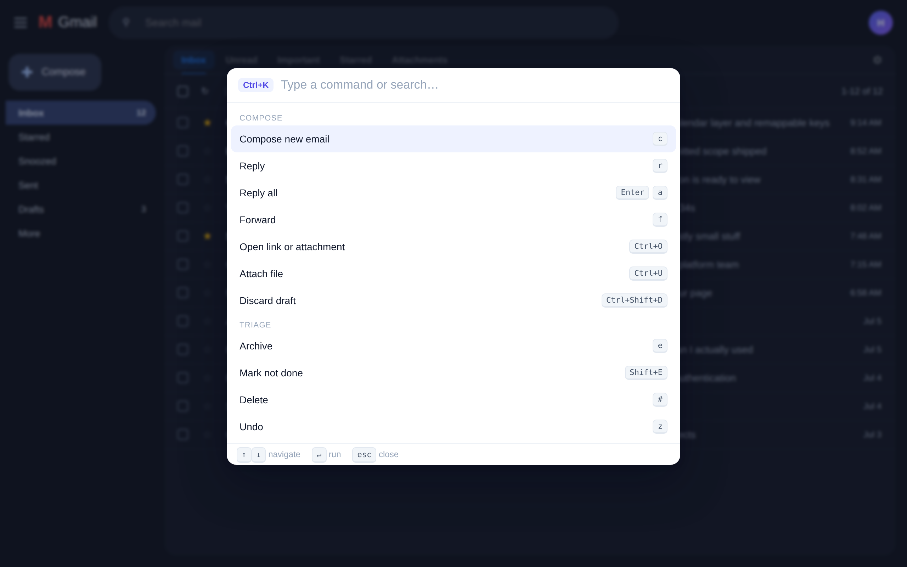
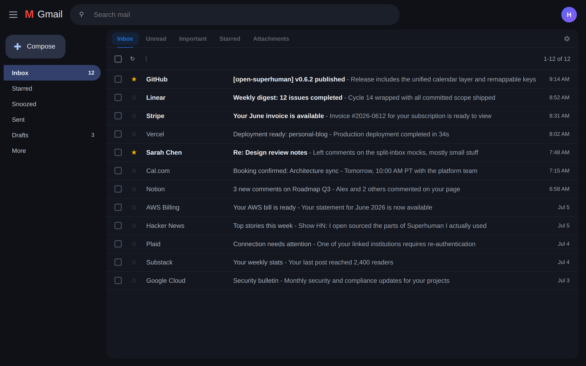
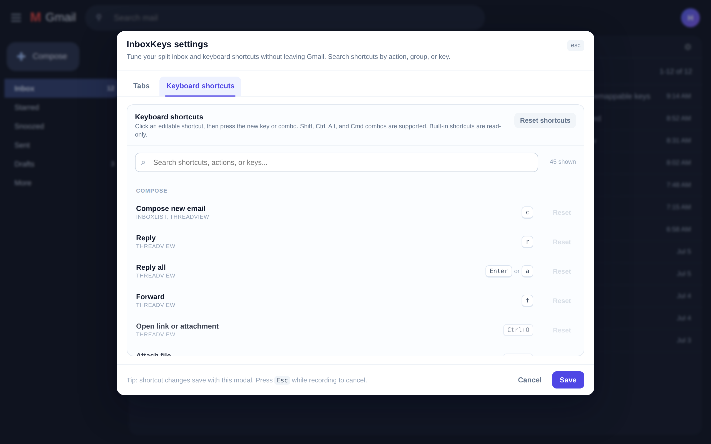
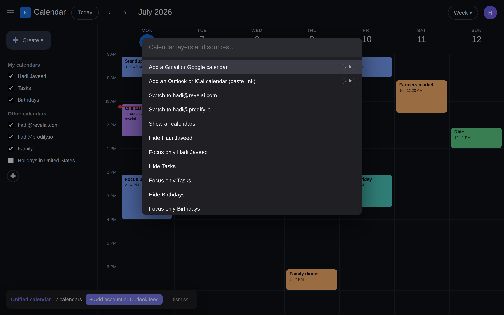

---
authors:
  - hjaveed
hide:
  - toc
date: 2026-07-07
readtime: 4
slug: open-sourcing-superhuman
comments: true
---

# Open Sourcing Superhuman, on Top of Gmail

I paid for Superhuman for years. If I am honest about what I actually used, it was keyboard shortcuts, the command palette, and split inbox. That is it. Thirty dollars a month for muscle memory.

Nothing against Superhuman. It taught me how fast email can feel. But after the Grammarly acquisition, the innovation slowed down. They tried to make AI the story, and meanwhile Gmail quietly shipped the same features natively: summaries, drafting, smart search. All of that lives inside Gmail now, for free, and it works better because Google owns the data.

So the calculus flipped. I did not need a replacement email client. I needed the ten features I loved, on top of the Gmail that already won.

I built [Inbox Keys](https://github.com/hadijaveed/open-superhuman){:target="\_blank"}. It is open source, and it is [on the Chrome Web Store](https://chromewebstore.google.com/detail/inbox-keys-gmail-command/bfcdnkjplofjddlecpojhpoomdialafa){:target="\_blank"}.

<!-- more -->

[▶ Watch the 2-minute demo](https://www.youtube.com/watch?v=oyiEgL7-68s){:target="\_blank"}

## Cmd+K everything

Hit `Cmd+K` and fuzzy-search every action: compose, triage, jump to any folder, tab, or account. If you forget a shortcut, the palette is the shortcut.

The hotkeys are the ones your hands already know from Superhuman: `c` compose, `e` archive, `r` reply, `s` star, `h` snooze, `j`/`k` to move, `g i` inbox, `g 1` through `g 8` to jump between Google accounts.

## Split inbox, powered by Gmail search

A tab bar over Gmail where each tab is any Gmail search: `in:inbox is:unread`, `label:Clients`, `from:boss@x.com`. `Tab` and `Shift+Tab` cycle through them. Gmail renders the lists itself, so it never breaks the way scraped inboxes do.

## Every key is yours

Every shortcut is remappable from a settings modal that opens inside Gmail. Click a shortcut, press the new key or combo, done. Collisions are detected, and built-ins stay read-only so you cannot break the engine.

## One calendar for all of it

Press `0` and Google Calendar opens beside Gmail for the account you are in. On the calendar, `Cmd+K` opens a layer palette: toggle or focus any calendar, switch accounts, and merge everything into one view. Adding another Google account or an Outlook/iCal feed is a guided two-step flow, and the merge is Google's own calendar subscription, so Inbox Keys reads no event data.

Single keys work there too: `c` create, `t` today, `d`/`w`/`m` for day, week, month.

## The privacy stance is the whole point

This is where it gets fundamentally different from Superhuman, or any AI email startup.

No Gmail API. No server. No AI. No analytics. No build step. The only permission is `storage`, for your settings, kept locally.

Everything works by driving Google's own UI, the same clicks you would make, just faster. Inbox Keys never reads, sends, or stores a single email. Superhuman needs a copy of your entire mailbox on their servers to work. Inbox Keys needs nothing. Even the screenshots in this post are the real extension running over a demo inbox, because pointing it at real mail for a screenshot felt wrong.

Gmail's DOM is famously hostile to extensions, so the engineering leans defensive: navigation rides Gmail's own URL router, every load-bearing selector lives in one registry with a built-in smoke check, and failures are loud toasts instead of silently eaten keystrokes. When Gmail redesigns something, it is a one-minute fix, not a mystery.

## Install it

Grab it from the [Chrome Web Store](https://chromewebstore.google.com/detail/inbox-keys-gmail-command/bfcdnkjplofjddlecpojhpoomdialafa){:target="\_blank"}. Works on Chrome, Edge, Brave, and Arc. Open Gmail, hit `Cmd+K`, and you are home.

Prefer to read the code first? [Clone the repo](https://github.com/hadijaveed/open-superhuman){:target="\_blank"} and load the `extension/` folder unpacked. It is the same thing the store ships, no build step.

## The bigger point

I wrote about this with [Fino](fino-and-the-era-of-personalized-software.md): we are in the era of personalized, malleable software. When a coding agent can build and maintain a Chrome extension over a few weekends, the question stops being "which subscription do I pay for" and becomes "which ten features do I actually use, and why don't I own them?"

Superhuman was a $30/month lesson in what those features were. Inbox Keys is me keeping the lesson and dropping the subscription.

If you live in Gmail, [try it](https://chromewebstore.google.com/detail/inbox-keys-gmail-command/bfcdnkjplofjddlecpojhpoomdialafa){:target="\_blank"}. If Gmail moves something and a shortcut breaks, the repo is right there. That is the point.
