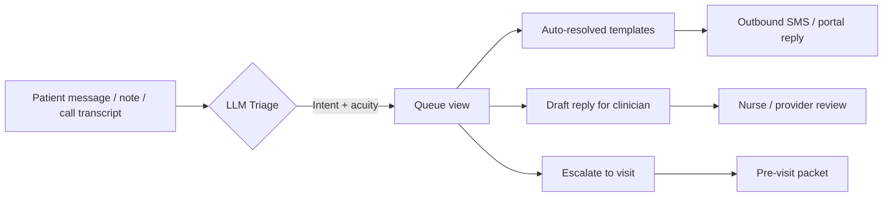
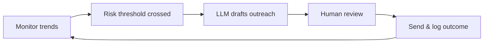

---
authors:
  - hjaveed
hide:
  - toc
date: 2025-09-16
readtime: 6
slug: building-a-patient-self-reporting-stack
comments: true
---

# Designing a Patient Self-Reporting Stack Around Humans and AI

Every care team I talk to has the same complaint: patients happily text, leave voicemails, and fill out surveys, but those signals rarely make it into the plan of care.

Electronic records were never built to absorb that ambient context, and the people who could act on it are already drowning in portal messages and follow-up calls. Yet the value is obvious, timely symptom reporting keeps people out of the ED, surfaces social needs, and lets providers adjust therapy before a flare turns into a crisis.

What we need is a stack that captures self-reported data, triages it with large language models, and still gives clinicians the last word. The winning pattern blends thoughtful UX, observability, and a human-in-the-loop workflow.

<!-- more -->

## Where Patient Self-Reporting Stands Today

- Remote symptom logging works when someone is watching. In the RELIEF pilot, oncology patients completed 80% of daily check-ins and nurses intervened on half of the triggered alerts, zero symptom-related ED visits during the study window ([Curr Oncol, 2021](https://pmc.ncbi.nlm.nih.gov/articles/PMC8544531/)).
- PROM and PGHD programs still stall in pilots. An umbrella review catalogued fractured adoption because implementation teams underinvested in workflow design, training, and staff capacity ([Syst Rev Protocol, 2024](https://pmc.ncbi.nlm.nih.gov/articles/PMC10964633/)).
- Integrating patient-generated data into the EHR is barely out of the lab. Only 19 studies met the bar in a 2019–2021 scoping review, most of them diabetes pilots that cited resource load and inconsistent review patterns as blockers ([JAMIA, 2021](https://pmc.ncbi.nlm.nih.gov/articles/PMC7969964/)).
- Portals add work faster than they add value. Cleveland Clinic primary care teams saw quarterly message volume double (340 → 695) and every 10 extra messages meant ~12 minutes more after-hours EHR time ([J Gen Intern Med, 2024](https://pmc.ncbi.nlm.nih.gov/articles/PMC10973312/)).

The signal is rich, but the stack is brittle. We ask patients to talk and then make it the nurse’s job to find needles in the haystack.

## Why the Workflow Breaks

1. **Fragmented entry points**: IVR trees, unsecured SMS threads, and chatbots all capture different slices of the story with no shared state.
2. **Review is entirely manual**: care coordinators listen to voicemails, gather context from the chart, and often re-document the same complaint in yet another system.
3. **Outbound outreach is slow**: when everything needs a human touch from scratch, patients feel ignored and high-acuity cases wait.
4. **No closed loop**: patients don’t hear back quickly, so engagement drops; clinicians don’t trust the data, so they stop looking.

We can’t fix this by “adding AI” to a broken assembly line. We need to reframe the patient self-reporting stack as an orchestration problem.

## Patterns for a Human-Centered Self-Reporting Stack

### 1. Intake that sets expectations up front

- Large language models can score acuity quickly (VUMC’s retrieval-augmented triage hit 0.98 sensitivity [JAMIA, 2024](https://pmc.ncbi.nlm.nih.gov/articles/PMC12089757/)).
- Patients hear a commitment (“a nurse will join in under a minute if needed” or “we’ll text you an answer in two hours”), which keeps engagement high.

### 2. Inbox triage that surfaces context, not noise

- Inbox views should group by **intent** (med refill, wound concern, paperwork) and stack related history—last summary, vitals, social determinants callouts.
- Drafting LLM replies isn’t about replacing clinicians; Mayo Clinic teams used AI drafts in ~20% of portal responses and reported lower task load afterward ([JAMA Netw Open, 2024](https://jamanetwork.com/journals/jamanetworkopen/fullarticle/2816494/)).
- Auto-resolution stays limited to low-acuity scripts (e.g., PT protocol reminders) and still leaves an audit trail.

### 3. Outbound nudges that feel bespoke

- Aggregated self-reports feed longitudinal trends (pain scores, medication adherence, social needs). When a metric drifts, the orchestrator drafts follow-up language tailored to that patient’s literacy and history.
- Humans confirm the plan, especially when it involves medication changes or complex counseling.

### 4. A shared workspace with observable loops

- Every automated action should show provenance: which notes were summarized, how the LLM scored acuity, and who signed off.
- Dashboards for clinical leaders track alert volume, average time to human response, and which prompts drive escalations.
- Patients see status indicators (“reviewed by triage nurse at 3:12 PM”), reinforcing trust that their data matters.

## How LLMs Help, When They’re Tethered to Humans

LLMs earn their keep by shrinking the research burden on the care team:

- Context gathering: assemble medication history, recent labs, and prior outreach before a human opens the chart.
- Summarization loops: recursive summaries keep cross-channel interactions digestible without losing dosage details or timelines.
- Acuity classification: flag high-risk language inside texts and voicemails instantly, so humans act faster.
- Drafting outbound communication: suggest responses that a nurse can approve or tweak in seconds.

But they always operate inside a governed loop. High-acuity cases trigger synchronous handoffs. Every draft carries a “source disclosure” showing the snippets the model used. Clinicians can thumbs-up or correct the draft, feeding evaluation back into the system.

## What We’re Building at RevelAI Health

At [RevelAI Health](https://revelaihealth.com/), we are stitching these patterns together so health systems don’t have to bolt on yet another point solution. Our orchestration layer listens to phone triage, portal inboxes, and AI-assisted callers, runs LLM-based acuity and intent models, and hands the care team a structured summary with suggested actions. Humans always close the loop, but they start from a prepared canvas instead of a blank screen.

The payoff is simple: patients know someone is listening, care teams spend time on judgment calls instead of transcription, and leaders can finally measure whether self-reporting is reducing avoidable visits.

Incumbent EHR vendors Epic, Cerner, the rest of the club certainly have the data gravity to tackle this, and they own the workflows inside the chart. But their strength on in-visit documentation hasn’t translated into nimble inbound and outbound engagement. Telephony integrations remain bolt-ons, multi-channel intent routing is brittle, and most of the tooling still assumes a human will manually stitch the story together.

We’re still refining evaluation datasets, UI treatments, and human review workflows—but the stack is finally showing that AI and thoughtful UX can make patient self-reporting actionable without losing the heart of human-centered care.

If you’re experimenting with your own self-reporting stack, I’d love to compare notes. The work ahead is making these loops tight, auditable, and empathetic.
