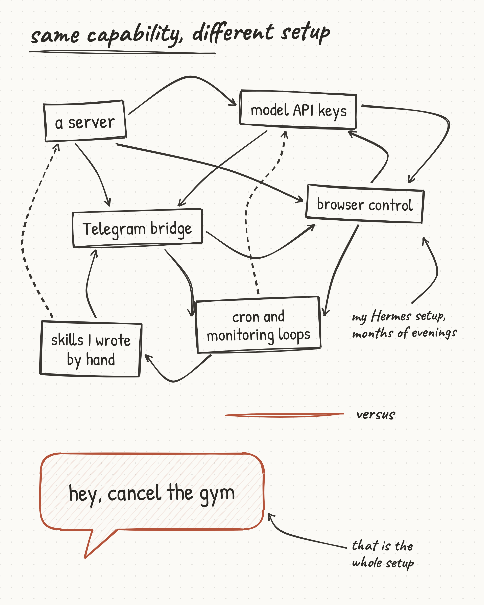
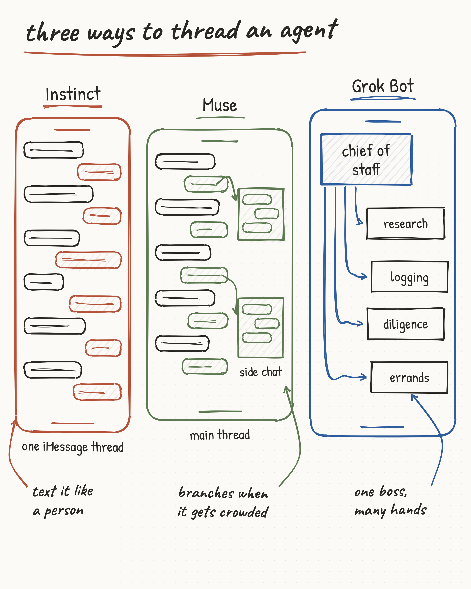
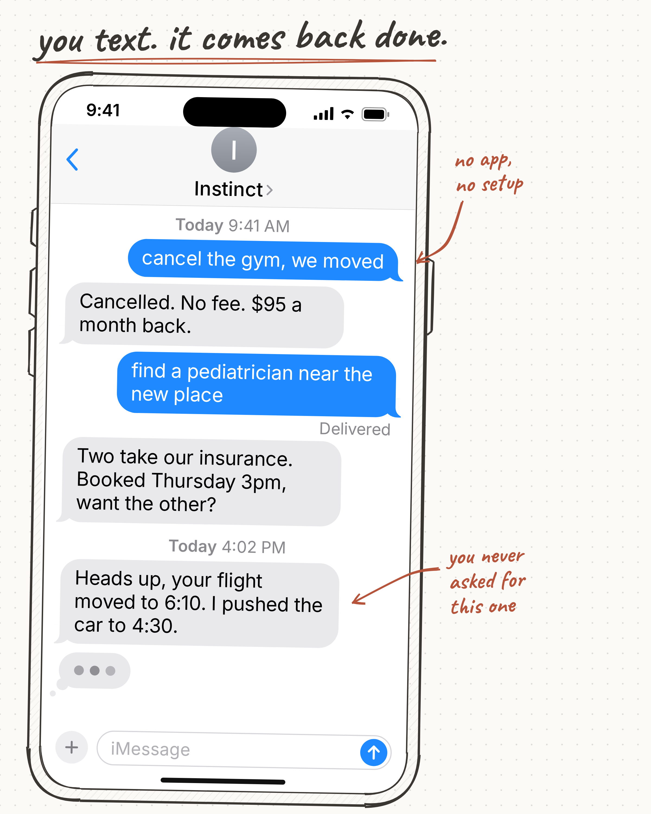
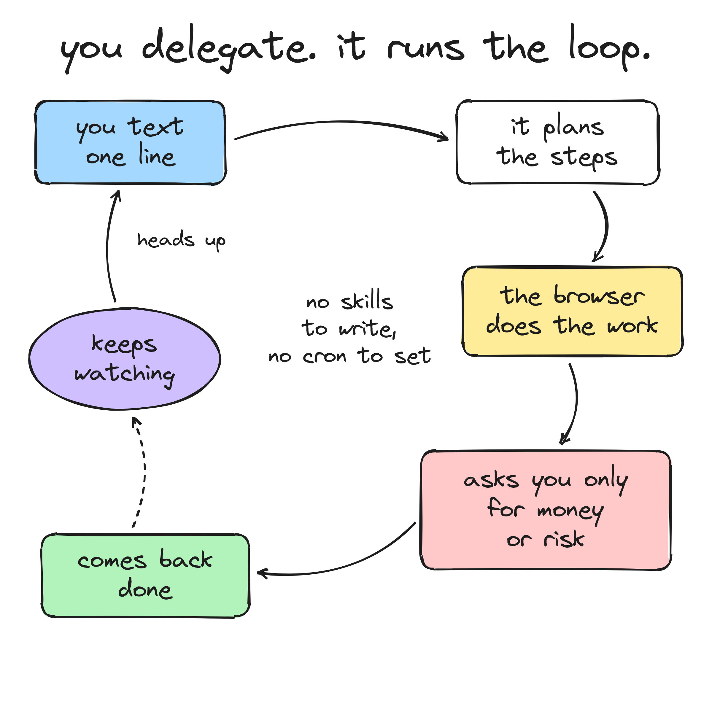
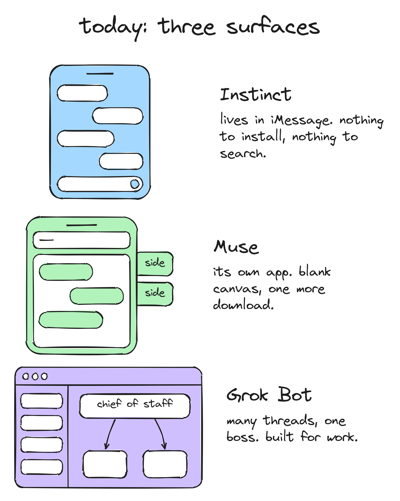
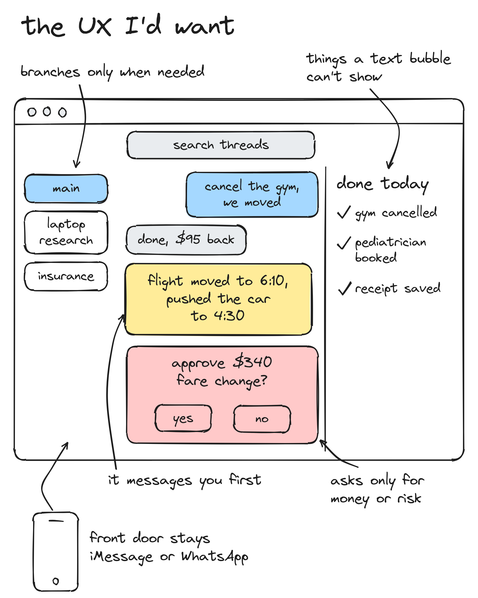
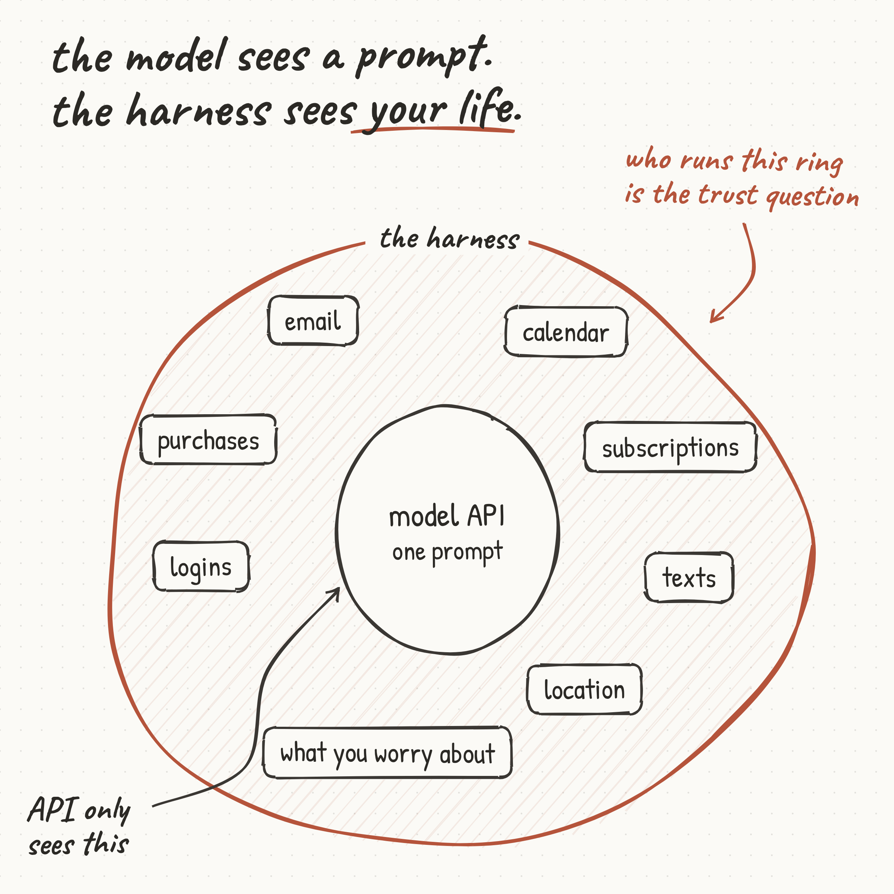
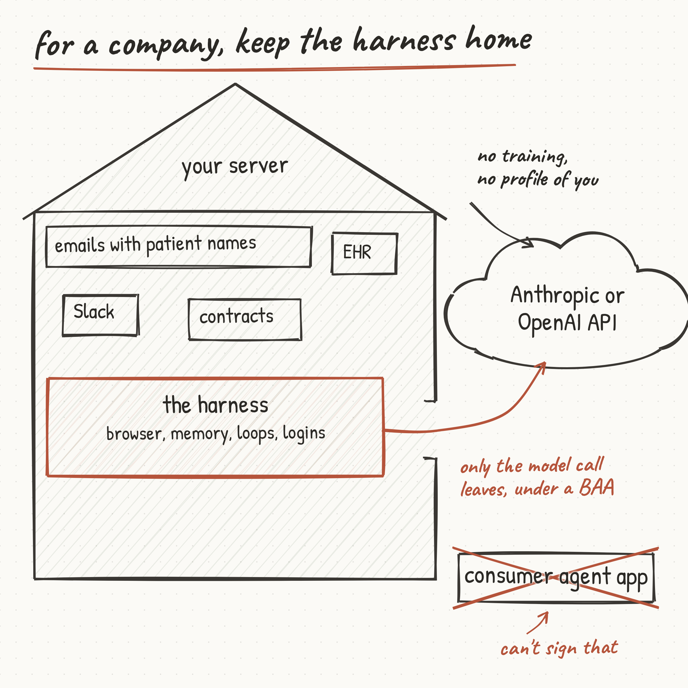

---
authors:
  - hjaveed
hide:
  - toc
date: 2026-09-22
readtime: 10
slug: personal-agents-are-a-ux-innovation
comments: true
draft: true
---

# Instinct and Muse Are UX Innovations. That's the Whole Point.

I've been running my own personal agent for months. Hermes on a server I control, reached through the Hermes desktop app, a mobile app on TestFlight, and Telegram. It books things, watches things, cancels things. So when Instinct and Muse showed up this month I had a strange reaction. Nothing they do is new to me. And I still want one.

This post is me trying to figure out why. What's actually different, why the single thread UX is the right call, where the trust problem sits, and why I think companies should keep the harness on their own servers.

<!-- more -->

## Nothing new under the hood

A harness, a browser it can scroll, a few monitoring loops, a chat surface on top. That's the whole architecture, and [OpenClaw](https://github.com/openclaw/openclaw){:target="\_blank"} and [Hermes Agent](https://github.com/nousresearch/hermes-agent){:target="\_blank"} have had it for a while. A lot of us built this already.

The catch was always the setup. Someone on LinkedIn titled their post [8 hours across 3 days to get OpenClaw working](https://www.linkedin.com/posts/jamesbickerton_8-hours-across-3-days-to-get-openclaw-working-activity-7431018915826143232-LfG0){:target="\_blank"}. There's a setup guide on GitHub that says it was [born from 15 days of struggle so yours takes 1](https://github.com/ishwarjha/openclaw-setup-guide-i-wish-i-had){:target="\_blank"}. My own list looked like this:

Instinct deleted that list. You get an invite, you text a number, and it starts asking for access one service at a time. Muse deleted it a different way: you download an app and sign in with an account Meta already knows everything about. Either way, the setup is gone. That is the product. And I don't think "just UX" is a put down. The UX is the reason my non-technical friends can have this and I couldn't give it to them before.

## Three ways to thread an agent

The interesting design choice across the three new products isn't the model or the browser. It's how they thread conversations.

- Instinct is one continuous thread over iMessage or WhatsApp. No projects, no workspace, [no structure at all](https://www.vellum.ai/blog/official-instinct-breakdown){:target="\_blank"}. You text it like a person.
- Muse is one main chat plus side chats. Meta's designers [built side chats](https://introducing.muse.ai/){:target="\_blank"} because early testers still wanted separate context for certain topics as projects grew.
- Grok Bot (from SpaceXAI, formerly xAI) is fully multi threaded. Every thread is its own agent on its own cloud computer, and a [chief of staff sits on top](https://x.ai/news/introducing-grok-bot){:target="\_blank"} with a specialist for each lane.

I think each one fits a different job. Grok Bot's shape makes sense for work, where you're running market research, logging and diligence in parallel and want each branch inspectable. Muse fits lifestyle stuff. Instinct fits errands. Same person, three contexts.

## Why the single thread wins

Here's what it looks like from the user's side, and why I think this ends up being the default for most people most of the time.

Three things are going on in that picture.

1. There is zero decision before delegation. No project to pick, no agent to choose, no skill to invoke. You say the thing. One Instinct user [described it well](https://www.mager.co/blog/2026-09-12-instinct/){:target="\_blank"}: as it earns your trust, "you stop composing a task and just ask what's on your mind."
2. Coordination moved from me to the agent. In my Hermes setup I write the skill, I set the cron, I define the monitoring loop. That's hours of my time per workflow. Instinct and Muse figure out the loop themselves. Muse's team says it explicitly, it [isn't a turn by turn experience](https://introducing.muse.ai/){:target="\_blank"}, you can interrupt it or send multiple tasks at once and it sorts them out. This is the part I underestimated.
3. Proactive messages land where you already look. The flight notice in the picture is the thing you never asked for. Nobody opens a dashboard for that. A text is the only surface where an unprompted "heads up" actually works.

Drawn from the user's seat, the whole thing is one loop, and none of the wiring is yours anymore.

The tell for me is Grok Bot. It's the multi thread product, and it still puts one chief of staff between you and the specialists so you don't have to manage them. Even the multi thread design converges on one contact.

Where multi thread still wins is real work. Parallel diligence needs separate context, separate evidence, separate review. Muse added side chats after early testers asked for exactly that, and Instinct users already report that [one thread gets crowded](https://www.usecarly.com/blog/what-is-instinct-ai/){:target="\_blank"}. So the shape I'd bet on is one main thread that you live in, with branches as the exception. Not a workspace of threads as the home.

## App or miniapp

The other split is where the agent lives. Side by side, the three surfaces look like this.

Instinct is what I'd call a miniapp: it lives inside iMessage, so there's nothing to install and nothing to learn. The cost is that it can't change iMessage. You can't search your threads, you can't see an approvals log, it can't render a receipt or a comparison table. The agent can do a lot, it just can't touch the UI it's sitting in. Instinct appears to be building a [Mac app](https://runtimewire.com/article/instinct-mac-app-imessage-local-browser-whoop){:target="\_blank"}, going by leaked screenshots, which tells you where the ceiling is.

Muse went the other way. Own app, blank canvas, room to show you what it's doing. The cost is you have to download and install something. Meta also put it inside WhatsApp, so they're hedging too.

I think both end up in the same place: a messenger as the front door, and an app for the things a chat bubble can't do. If I had to sketch it, it would look something like this.

## Trust is the whole ballgame

This is where I get stuck, and I don't think it's a small thing.

People keep pointing out that Claude or Codex might be the model behind these products, as if that settles it. It doesn't. The model API sees one request at a time. The harness is the thing that sees everything: your email, your texts, your purchases, which subscriptions you have, your logins, your calendar, where you are, what you're worried about. That's a complete picture of a person. Who runs the harness is the trust question.

Instinct's [privacy policy](https://instinct.com/privacy-policy){:target="\_blank"} says it collects keystrokes, clicks, cursor positions, precise location, passwords and health data, shares data with unnamed "third party AI model providers," and doesn't state where it's stored or for how long. TechCrunch [documented](https://techcrunch.com/2026/08/24/instincts-powerful-ai-assistant-is-raising-privacy-and-security-concerns/){:target="\_blank"} it keeping email after access was revoked, storing emails in plain text, sending an email nobody approved, and getting phished by instructions planted in an inbox. This is a five month old company that just raised at a $2.5B valuation, so they'll fix a lot of it. But it happened.

Meta has a bigger disadvantage here and everyone knows it. Muse's launch post says conversations [don't feed Meta's ad systems](https://about.fb.com/news/2026/09/introducing-muse-personal-ai-agent/){:target="\_blank"}, but actions it takes on outside websites [can indirectly influence ads](https://kingy.ai/blog/meta-muse-personal-ai-agent-features-comparison/){:target="\_blank"}, interaction trajectories train the model unless you opt out, and the user keyed confidential VM is planned for later. So the protection today is policy, not cryptography. Add the history: the Meta AI app [publishing people's medical and legal chats](https://www.malwarebytes.com/blog/news/2025/06/your-meta-ai-chats-might-be-public-and-its-not-a-bug){:target="\_blank"} last year, and the December change that started using AI chats [to personalize ads](https://about.fb.com/news/2025/10/improving-your-recommendations-apps-ai-meta/){:target="\_blank"}, with no way to opt out short of not using Meta AI. And this week Amazon [blocked Muse](https://www.geekwire.com/2026/amazon-blocks-metas-muse-ai-assistant-in-new-standoff-over-agentic-shopping/){:target="\_blank"} from shopping on users' behalf, saying it doesn't identify itself and appears to store credentials. Meta disputes the credential claim.

So Meta is behind on trust. But honestly, do I trust a young startup either? Instinct's incidents weren't Meta's incidents. This isn't a Meta problem, it's a harness problem. Whoever runs the harness has your life, and right now none of them have earned it.

What would move me: a user keyed VM that actually ships, named model providers, a stated retention period, an audit log I can read, and delete that means delete. I hope this changes over time, because the form factor is clearly the future.

Until then I'm sticking with my own harness. It's uglier and it took longer. But I know exactly what it stores and where. I'm not pretending self hosting is safe by default either. OpenClaw's skill marketplace had [hundreds of malicious skills](https://www.esecurityplanet.com/threats/hundreds-of-malicious-skills-found-in-openclaws-clawhub/){:target="\_blank"}, and researchers found [tens of thousands of instances](https://www.infosecurity-magazine.com/news/researchers-40000-exposed-openclaw/){:target="\_blank"} exposed to the internet. When you own the harness you own the security too.

## For a company, keep the harness home

The personal version of this is a preference. The company version is not.

My startup inbox has patient names in it. So does Slack, so do the contracts, and the EHR obviously does. A consumer agent that reads my email is a HIPAA problem on the first day. This is already happening without agents: Netskope found [71% of healthcare workers use personal AI accounts for work](https://www.hipaajournal.com/healthcare-workers-privacy-violations-ai-tools-cloud-accounts/){:target="\_blank"}, and most of the resulting policy violations involve regulated health data. Give those same people an agent with browser access and cached logins and the number gets worse.

The shape that works: the harness runs on your own infrastructure, with the browser, the memory, the loops and the logins. The only thing that leaves is the model call, and it leaves under a BAA. Both [Anthropic](https://privacy.claude.com/en/articles/8114513-business-associate-agreements-baa-for-commercial-customers){:target="\_blank"} and [OpenAI](https://developers.openai.com/api/docs/guides/your-data){:target="\_blank"} sign BAAs for API use, and Anthropic explicitly excludes its consumer plans. A consumer agent app can't make that promise. So for companies handling regulated data, self hosting isn't paranoia. It's the only compliant option today, and I think it stays that way for a while.

## Monetization is still very WIP

Instinct is free while it's in beta, with no published price. Muse is [free, or $20, or $100 a month](https://www.meta.com/help/subscriptions/1021145227643680){:target="\_blank"}. Grok Bot is bundled into SuperGrok and Cursor subscriptions. Nobody has figured this out yet.

Seats and tokens are the obvious models and both hurt acquisition. What feels right to me for an agent that cancels my gym is a cut of what it saves. Rocket Money already charges [35 to 60% of first year savings](https://help.rocketmoney.com/en/articles/9744474-bill-negotiation-charge-explained){:target="\_blank"} on bill negotiation, and only when it succeeds. If an agent gets me $100 back, I'd happily give it $5. The merchant side of this is harder. OpenAI tried charging merchants on completed purchases with Instant Checkout and [replaced it in March](https://www.cnbc.com/2026/03/24/openai-revamps-shopping-experience-in-chatgpt-after-instant-checkout.html){:target="\_blank"} after only about 30 merchants signed up. Charging the user on savings feels different from charging the merchant on sales, but I haven't seen anyone prove it yet.

## Where I land

The amount of agentic commerce that's happened in a few weeks is incredible. People are buying laptops, booking restaurants and haggling subscriptions through a text thread. UX innovation is real innovation. The single thread, the delegation, the proactive message: that's the right shape, and I did all the hard work to get it the ugly way. I'm still a little jealous of how clean theirs feels.

Trust decides who wins this. Not the model, not the browser. If you've moved your life into one of these, I'd like to know what got you over the line.
