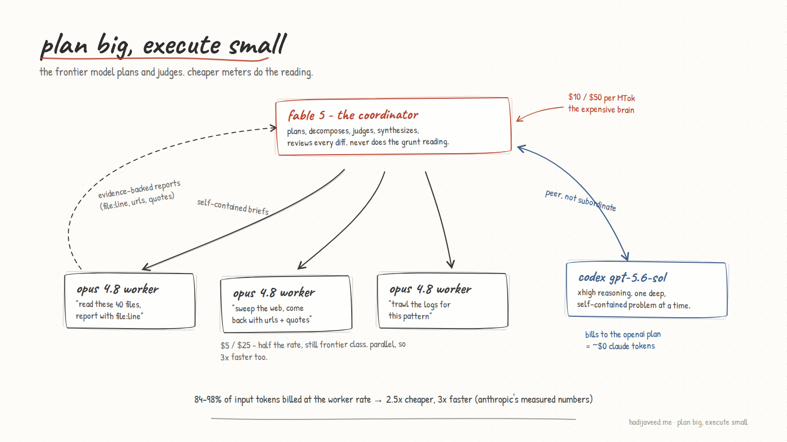

---
authors:
  - hjaveed
hide:
  - toc
date: 2026-07-07
readtime: 6
slug: plan-big-execute-small
comments: true
---

# Plan Big, Execute Small: Taming My Fable 5 Bill Without Dumbing It Down

I run Claude Fable 5 as my daily driver in Claude Code. It is the best model I have used, and it is priced like it: $10 per million input tokens, $50 per million output. The painful part is that most of what an agent does all day is not deep reasoning. It is reading. Files, web pages, logs, search results, all pulled through the most expensive brain money can buy.

Then I found an Anthropic cookbook that reframed the whole problem: [Plan Big, Execute Small](https://github.com/anthropics/claude-cookbooks/blob/main/managed_agents/CMA_plan_big_execute_small.ipynb){:target="\_blank"}. One notebook, one idea: let the frontier model plan and judge, let cheaper models do the mechanical reading. I liked it enough that I turned it into a Claude Code skill, and it has changed how I work.

<!-- more -->

## What the notebook actually shows

The cookbook builds a research team on Claude's Managed Agents API. A Fable 5 coordinator owns the plan: it breaks a research question into focused sub-questions and delegates each one to Sonnet 5 workers that only have web search and fetch. Workers read hundreds of thousands of tokens of web pages. The coordinator only ever reads their distilled, evidence-backed reports.

The numbers are what sold me. On the same research task:

- Split team: **$1.61**. Solo Fable agent: **$4.00**. About 2.5x cheaper.
- 3x faster, because workers run in parallel.
- 84-98% of input tokens got billed at the worker rate instead of the frontier rate.

The detail that matters most: both setups read roughly the **same amount**. The savings are pure rate arbitrage. Nobody skimmed. Nobody cut corners. The work just moved to a cheaper meter. That is the whole trick, and it is also the trap to avoid: if you respond to cost pressure by telling one expensive agent to "read less," you did not build a cheaper equivalent, you built a lower-rigor product.

## Turning it into a Claude Code skill

Here is the thing: you do not need the Managed Agents API to use this pattern. Claude Code already has the primitives. The Agent tool takes a `model` parameter, so the main loop (Fable, in my case) can spawn parallel subagents on Opus 4.8 or Sonnet 5 for the heavy reading while it keeps the thinking to itself.

What was missing was the discipline. So I had Claude craft a skill, `plan-big-execute-small`, that encodes the cookbook's rules as a repeatable procedure. The core of it:

1. **Classify the work.** Judgment stays in the main loop: decomposing the problem, resolving conflicts between reports, verifying anything load-bearing, reviewing diffs, writing the final answer. Mechanical volume gets delegated: read N files and report X, search the web for Y, trawl logs for Z. And deep, self-contained problems get handed to a peer agent (more on that below).
2. **Fan out on cheaper meters.** Parallel subagents with `model: "opus"` as the default worker tier, dropping to `"sonnet"` only for truly rote high-volume reading. Every token a worker reads instead of the main model is a 2-5x saving on that token.
3. **Write real briefs.** Workers know nothing you do not put in the prompt. Each brief is one self-contained sub-question, with explicit rigor instructions ("try multiple phrasings, follow leads, cross-check sources") and a required report format: structured findings with evidence. File and line references, URLs, verbatim quotes. Not essays.
4. **Synthesize from reports, never re-read the sources.** Re-reading what a worker already read pays the expensive rate twice and defeats the point.

And the anti-patterns, which the cookbook measured rather than guessed at:

- **Do not over-shard.** Delegation has a floor. Every worker pays a bootstrap cost, and in Anthropic's own tests, narrowly-scoped micro-briefs made the run *more* expensive. A few meaty workers beat twenty tiny ones.
- **Do not delegate judgment.** Architecture decisions, final synthesis, diff review, anything security-sensitive: that is what the expensive tokens are for.
- **Do not cut rigor to cut cost.** Move the reading, keep the standard.

## The cross-vendor twist: Codex as a peer agent

The skill grew a second leg the cookbook never mentions. I have OpenAI Codex CLI on the same box, authenticated against my OpenAI plan and running gpt-5.6-sol at xhigh reasoning. That changes the arbitrage math completely: a task delegated to Codex costs me approximately zero Claude tokens. Just the brief going out and the report coming back.

So the skill treats Codex as a **peer work-agent, not a subordinate**. Claude subagents get the volume work; Codex gets one gnarly, well-specified, self-contained problem at a time:

- **Backend implementer.** Fable writes the spec and acceptance criteria into a brief, Codex implements it in the checkout, Fable reviews the diff and runs verification.
- **Cross-vendor reviewer.** I implement with Claude, then have Codex try to refute the diff read-only. Different model families genuinely catch different bugs.
- **Research peer.** For meaty questions, fire Codex and an Opus subagent at the same question in parallel, then triangulate the two independent takes.

Two rules make this safe. First, **one writer at a time**: I do not use git worktrees, everything happens in the main checkout, so when Codex is implementing, Claude keeps its hands off the files, and when Claude writes, Codex runs read-only (`-s read-only`). Second, **do not use Codex for volume**: xhigh reasoning is slow and deep, the wrong tool for "read these 40 files." That is a subagent's job.

The mechanics are simple: `codex exec` in the background with `-o report.md`, so even its final report stays out of the expensive context until Fable chooses to read it. And because Codex is a different vendor entirely, the brief discipline matters double: it sees nothing of the conversation, so the brief carries the full spec, constraints, and file paths.

## The quality question

My first worry was obvious: does farming work out to cheaper models degrade the output? My answer after using it: not if you hold two lines.

First, a model floor. I banned Haiku from worker duty entirely and settled on Opus 4.8 as the default worker tier, with Sonnet 5 allowed only for truly rote high-volume reading. Opus at half of Fable's rate is still a real saving, and it means the workers doing my research and debugging are frontier-class themselves. Haiku is where the quality risk actually lives, and skipping it costs me very little of the arbitrage.

Second, evidence-bearing reports. Because every worker has to return quotes, URLs, and file references, the coordinator is never trusting a vibe. If a finding looks thin, it sends one targeted verification instead of redoing the sweep. And when the stakes are high, the cross-vendor review closes the loop: a second model family reading the same diff is the cheapest independent audit I know of.

## It already paid for itself

The fun part: this very post was produced with the pattern. A Sonnet subagent swept this repo for the blog conventions (frontmatter shape, author keys, link syntax, build commands) and reported back a tight, evidence-backed brief, while the main Fable loop spent its tokens on the part I actually care about: the writing. The mechanical reading never touched the expensive meter.

That is the shape I now reach for on anything token-heavy: research sweeps, codebase audits, multi-file refactor scouting. Plan big. Execute small. Read the cookbook, steal the pattern, and if you use Claude Code, encode it as a skill so you stop paying frontier prices for grunt work.
