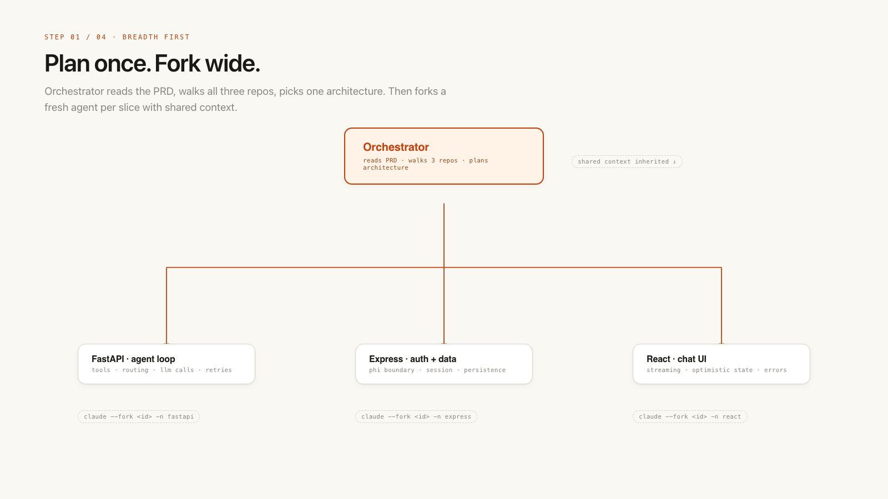
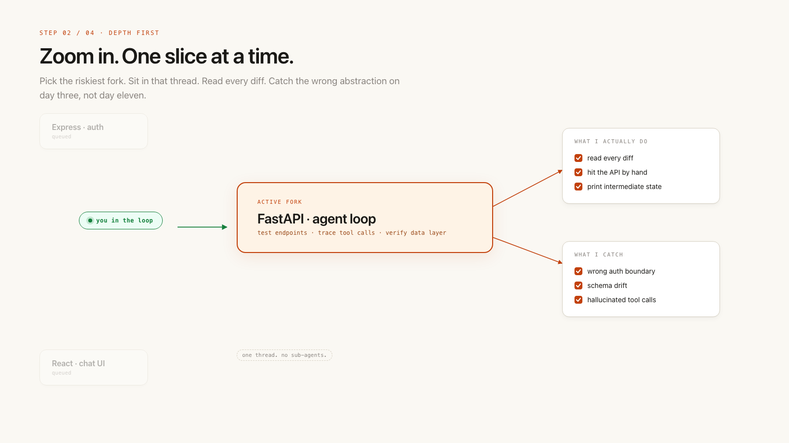
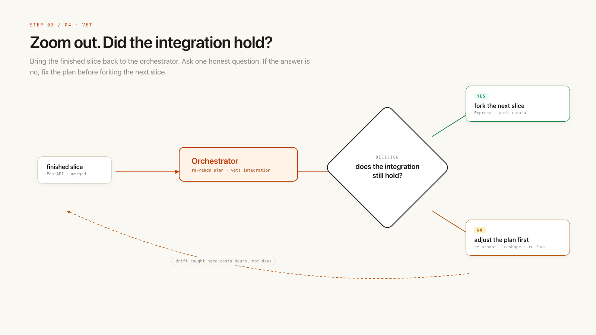
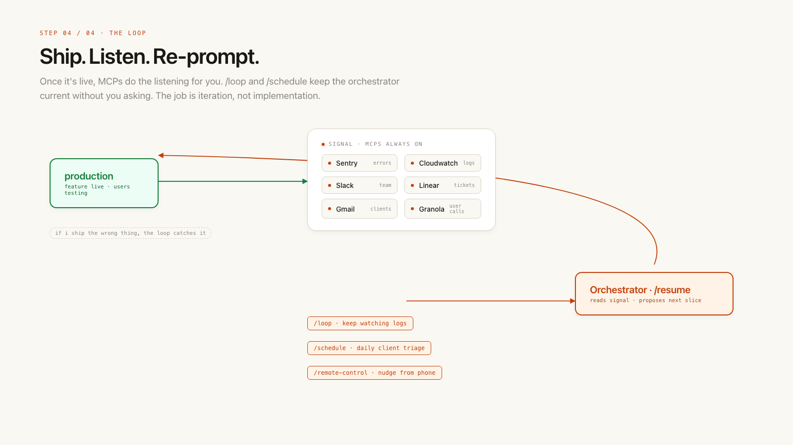

---
authors:
  - hjaveed
hide:
  - toc
date: 2026-04-23
readtime: 5
slug: shipping-fast-with-claude-code
comments: true
---

# Claude Writes the Code. You Run the Loop.

I have been building a lot with Claude recently. Obviously, you can ship code very quickly now. But how do you plan large features, understand UX, brainstorm different patterns, and then ship across 3 repos in an established codebase without breaking things?

The goal is to put large features in front of customers in weeks, not months. Test your assumptions and iterate on top of real feedback.

<!-- more -->

There is a lot of hype around multi-agent workflows, where an orchestrator agent spawns multiple child agents, checks their progress, and figures out what is going on.

That works fine for code exploration or when an agent needs to build context. During implementation, it usually does not work well for me. I like keeping one strong thread in general. Claude has gotten really good at autonomously executing tasks when the context is clean.

The software engineering pattern still holds in my mind: decompose larger problems into smaller sub-problems, then combine those sub-problems back into one working system.



## Start the work with breadth-first approach

When starting a new feature, I always start breadth first:

- ask the agent to gather context through code exploration and the PRD
- create tasks and spend real time planning
- stay in the planning phase for a while: explore UX alternatives, research competitors, and understand the system

Once the plan is solid, I switch to depth first. Think of the orchestrator as a staff-level software engineer you keep checking in with: how are the agents performing, what is working, what is not working, and where do we need to go next?

I have been working on a patient chat feature that spans 3 repos. It involves a backend model that fetches data from multiple resources, an agent loop, orchestration, and a full frontend experience.

It looks easy from the outside. But when you are dealing with many data sources, auth patterns, patient data security, and frontend UX, the complexity adds up quickly. Even with good planning, mistakes can slowly compound. Next thing you know, you are running in an endless loop.

## Depth first approach when going deep on things

When there is a specific UI, backend flow, or feature slice I need to build, I spawn another Claude Code terminal instance:

```bash
claude --fork orchestrator-agent-id -n chat-agent
```

This agent inherits the context from the orchestrator. Depending on the state of the thread, I either compact first or start from there.

Yes, Claude can do a lot on its own. But depth first does not mean I disappear. I want to stay in the loop because there are certain product and architecture decisions Claude can still get wrong.

While Claude is cooking in the focused fork, I may go back to the orchestrator and talk through integration. That helps me zoom out.

Then I zoom back in and test the feature in detail: API layer, UX layer, data layer, and tests.



## Keep checking with the orchestrator

There is other UX research I will do.

A lot of people talk about spinning up many sub-agents. That can work for exploration, but during implementation I prefer clean context that is easy to reason about.

Usually in Claude Code, I compact around 400,000 tokens. That is my default setting.



## Keep the loop going



- ship the first version, then commit your `.md` plan and intent to the repo. Yes, ship it with the code.
- write down the PRD: the problem, the solution, and how you are going to test your assumptions.
- gather client feedback, logs, and results from Gmail MCP, Slack MCP, Linear MCP, CloudWatch MCP, Sentry MCP, and whatever else gives you signal.
- ask the orchestrator to read the plan or `/resume` the session. Ask where we left off, what is missing, and what needs attention.
- ask it to act like a staff engineer and product manager: improve UX, investigate bugs, and make the feature easier for users.
- talk to users. I use Granola MCP and record meetings while I shadow them. I ask what they would change and why the current flow is hard.
- make quick product decisions with Claude Code in the loop.
- be fine shipping the wrong first version, as long as the iteration loop is tight. My job is to craft a solution that solves the end-user problem. Code is a means to an end.

The orchestrator is my staff-level engineer who is always with me. I am its manager. The sub-agents are junior engineers, but knowledgeable ones.

Once a new feature is shipped, I use `/loop` and `/schedule` to keep checking logs. I have skills that look for client issues as they come up, so the orchestrator stays up to date.

I also use `/remote-control` with the orchestrator to trigger work from mobile. I obsess about the end UX and keep improving the iteration.

We are still very early in this process. Things change every day. A lot of these patterns will hold. Some might not.

Have fun building.

In case it is helpful, here is my Claude Code config.

The most important thing here is context discipline. Adaptive thinking, 1M token context, and agent team features have not been that helpful for me so far.

```json
{
  "env": {
    "CLAUDE_CODE_DISABLE_ADAPTIVE_THINKING": "1",
    "CLAUDE_CODE_AUTO_COMPACT_WINDOW": "400000",
    "DISABLE_ERROR_REPORTING": "1",
    "CLAUDE_CODE_DISABLE_FEEDBACK_SURVEY": "1"
  },
  "alwaysThinkingEnabled": true,
  "effortLevel": "xhigh",
  "autoMemoryEnabled": true,
  "showThinkingSummaries": true
}
```

By the way, this blog is not written by AI. AI and LLMs have amazing applications, but for writing I still want to write myself. I want my blogs to reflect the true me.
