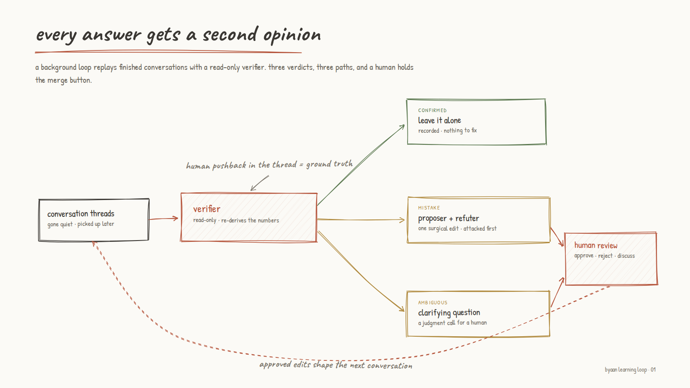
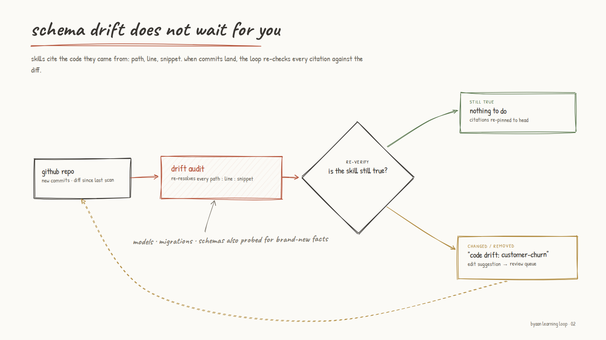

---
authors:
  - hjaveed
hide:
  - toc
date: 2026-07-18
readtime: 6
slug: the-learning-loop
comments: true
---

# The Learning Loop: A Data Agent That Audits Its Own Answers

Text-to-SQL is a demo. Keeping the numbers right for months while the schema moves underneath you is the actual product. Byaan closes that gap with auto-evolving skills: every conversation gets adversarially reviewed, mistakes become skill edits backed by code evidence, ambiguity becomes a question, and subject matter experts hold the merge button.

<!-- more -->

Production data is messy. Column names change all the time. Business logic drifts. Someone pushes a migration on Tuesday and nobody tells the data team. The agent that was right in April is confidently wrong in June, and nobody notices until a number looks off in a board deck. I stopped treating this as a prompt problem. It is a feedback problem. The model is fine. The ground truth keeps moving. So instead of chasing a bigger model, I gave Byaan a learning loop.

## Skills are the memory

Byaan's knowledge about your data lives in skills: small markdown documents that capture how a metric is actually computed, including the tribal knowledge that never makes it into the schema. A skill looks like this:

```markdown
---
name: customer-churn
description: How churn is defined and calculated for monthly reporting
---

A churned customer is one whose subscription lapsed and did not renew
within 30 days.

- Use `subscriptions.status = 'canceled'`, not `customers.is_active`.
  That flag is refreshed by a nightly job and lies for most of the day.
- Exclude the `legacy_free` plan. Those accounts never paid; they
  cannot churn.
- Group by `canceled_at`, not `updated_at`. The `updated_at` column
  moves every time any field on the row is touched, which quietly
  inflates recent months.

Sources: server/models/subscription.py:41 · dashboards/retention.sql
```

When someone asks "what was churn last quarter," the agent pulls this skill and follows it. The question is: who keeps these documents true? Not me, manually, forever. That is what the loop is for.

## Auto-evolving skills, borrowed from Hermes

Nous Research's [Hermes Agent](https://github.com/NousResearch/hermes-agent){:target="\_blank"} got this right for personal agents. Hermes writes its own skills as it works: finish a complex task, hit a dead end and find the way out, get corrected by the user. The agent captures the lesson as a markdown skill and grows from there. "The agent that grows with you" is exactly the right idea, and it is the approach Byaan takes for data.

The difference is who approves. Hermes is a personal agent, so skill edits are staged for its owner: you review your own agent's homework. A data agent answers questions for a whole company. A wrong definition of churn does not bite one person, it ships in a board deck. So Byaan's auto-evolving skills come with two things a personal agent does not need. Every skill is backed by code evidence, citations into the actual repo. Every change passes an adversarial review before a human ever sees it. And the human is not whoever happened to be chatting. Approval goes to the people who own the definitions: subject matter experts and data experts.

## Every answer gets a second opinion



Every conversation in Byaan is stored as a thread. A background loop sweeps those threads, picks the ones that have gone quiet, and replays them with a verifier agent. The verifier is deliberately paranoid and deliberately powerless: it runs read-only queries only, it re-derives the key numbers independently instead of trusting the transcript, and it treats one thing as sacred: if a human pushed back anywhere in the thread, that correction is ground truth.

It returns one of three verdicts: confirmed, mistake, or ambiguous. Confirmed gets recorded and left alone. The other two are where it gets interesting.

## Propose one change. Then try to kill it.

When the verifier finds a mistake, a second agent takes over with two jobs that fight each other. First, propose exactly one surgical change to a skill that would have prevented the mistake. Second, refute that proposal adversarially: would it overfit to this one conversation? Contradict existing guidance? Cause regressions on questions it was never meant to touch? Only a proposal that survives its own attack becomes a suggestion.

Without the refuter, this degenerates fast. Twenty conversations produce twenty new rules, half of them contradicting each other, and the skill turns into soup. One surgical change that survived an attack beats five plausible ones that did not.

What comes out the other end looks like this:

> **Suggested edit · customer-churn**
>
> The July 12 conversation reported churn grouped by `updated_at`. The user corrected it to `canceled_at` mid-thread. Add to the skill: "Group by `canceled_at`, not `updated_at`; it moves on any row touch and inflates recent months."
>
> Refuter: survives. Scoped to one metric, consistent with existing guidance.
>
> `Approve` · `Reject` · `Discuss`

## When the data is ambiguous, ask

Some conversations are not wrong, just underdetermined. The verifier flags those too, and instead of guessing, the loop asks:

> **Byaan needs a judgment call**
>
> In Tuesday's thread, finance asked for "active customers in Q2." I counted paying accounts only. Should trial accounts that converted mid-quarter count for the full quarter, or from their conversion date?
>
> `Answer in Byaan`

That is a question no model should answer on its own, because the answer is not in the data. It is a business decision. Once someone answers, the answer gets folded into the skill and the question never comes back.

## The human holds the merge button

Nothing in this loop auto-applies. Every proposed edit, every new skill, every clarification lands in a review queue: a page in Byaan and a card in Slack for the data engineers and governance folks, with Approve, Reject, and Discuss. Only owners and admins can approve. Every approval snapshots a version, so a bad edit rolls back like code. A daily digest summarizes what the loop verified and what is still waiting on a human.

I wanted to remove the human from this loop. I could not, and I have made peace with it. When "active customer" has three defensible definitions, someone with context has to pick one. The loop's job is not to replace that judgment. It is to make sure judgment gets exercised once, captured permanently, and never needed again for the same question.

We applied this approach at RevelAi Health, and it improved the agent a lot. Yes, it is work. Someone spends a few minutes a day approving an edit, rejecting a bad one, answering a judgment call. That is the deal. A few minutes a day is how you build knowledge. The alternative is re-explaining the same definition of churn in every conversation, forever.

## Code drift is data drift



The sneakiest way a data agent goes stale has nothing to do with conversations. A developer renames a column, changes how a status is derived, adds a plan type. The warehouse looks the same. The meaning changed.

So skills in Byaan cite the code they came from: file path, line, snippet. The loop keeps syncing with GitHub, and when new commits land it re-checks every citation against the diff and re-verifies the skill's claims: still true, changed, or removed. A claim that no longer holds becomes a "Code drift: customer-churn" suggestion in the same review queue. High-value files like models, migrations, schemas, and config also get probed for new facts worth capturing as a skill in their own right.

This matters because how a metric is calculated often lives in code, not in anyone's head. Your dashboards and your agent read the same repository. Only one of them notices when it changes.

## The loop is the product

The accuracy of a data agent on day one is a benchmark. Its accuracy in month six is a system. Every pass through this loop, the agent gets a little harder to fool: mistakes become guardrails, ambiguity becomes policy, code drift becomes a review card instead of a silent wrong number.

The model was never the bottleneck. The feedback was.
